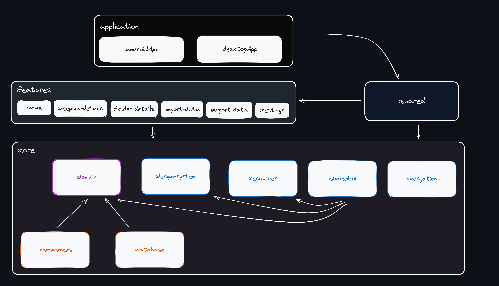

  

<h1 align="center">DeepLink Launcher</h1>

  DeepLink Launcher is a multiplatform app designed for executing and managing deeplinks. This tool offers developers and QA teams an intuitive interface for testing, organizing, tracking, and sharing deeplinks.

  
  

## Demo

https://github.com/user-attachments/assets/bdb590c7-f4ad-4aaa-b11e-399fa2b07435

## Platforms

  <table>
    <tr>
      <th>Platform</th>
      <th>Status</th>
      <th>Download</th>
    </tr>
    <tr>
      <td>Android</td>
      <td>✅</td>
      <td></td>
    </tr>
    <tr>
      <td>iOS</td>
      <td>✅</td>
      <td>Not yet released.</td>
    </tr>
    <tr>
      <td>Desktop</td>
      <td>✅</td>
      <td>Download the version compatible with your OS <a href="https://github.com/FelipeKoga/deeplink-launcher/releases">here</a></td>
    </tr>
  </table>

## Features
- **Execute Deeplinks**: Quickly and easily execute deeplinks on Android and iOS Devices.
- **Device Bridge**: The Desktop App integrates with ADB and xcrun to execute deeplinks in real-time on Android and iOS devices. This feature enables direct communication with emulators and physical devices.
- **Auto-suggestion**: Get automatic suggestions for deeplinks based on previously executed links.
- **Deeplink History**: Track all executed deeplinks.
- **Favorites**: Mark deeplinks as favorites for quick access.
- **Folders**: Organize deeplinks into folders for efficient management.
- **Export/Import**: Share or backup deeplinks and folders in JSON or TXT formats.
- **Duplicate DeepLink**: Easily duplicate existing deeplinks, saving time when creating similar entries or variations.
- **Theme Support**: Customize your experience by switching between Light and Dark modes.
- **Search**: Quickly find deeplinks by searching for keywords.

## Built With

  <table>
    <tr>
      <th>Technology</th>
      <th>Description</th>
    </tr>
    <tr>
      <td><a href="https://github.com/JetBrains/compose-jb">Compose Multiplatform</a></td>
      <td>Modern UI toolkit for building native UIs across all platforms.</td>
    </tr>
    <tr>
      <td><a href="https://github.com/adrielcafe/voyager">Voyager</a></td>
      <td>A multiplatform navigation library.</td>
    </tr>
    <tr>
      <td><a href="https://insert-koin.io/">Koin</a></td>
      <td>Dependency injection framework for Kotlin.</td>
    </tr>
    <tr>
      <td><a href="https://cashapp.github.io/sqldelight/">SQLDelight</a></td>
      <td>Multiplatform database library generating typesafe Kotlin APIs.</td>
    </tr>
    <tr>
      <td><a href="https://developer.android.com/jetpack/androidx/releases/datastore">DataStore</a></td>
      <td>Modern data storage solution for storing key-value pairs or protocol buffers with Kotlin coroutines.</td>
    </tr>
    <tr>
      <td><a href="https://m3.material.io/">Material3</a></td>
      <td>Design system that provides a consistent, intuitive set of user experiences across platforms.</td>
    </tr>
    <tr>
      <td><a href="https://github.com/Kotlin/kotlinx.collections.immutable">Kotlinx Immutable</a></td>
      <td>Immutable collections for Kotlin.</td>
    </tr>
    <tr>
      <td><a href="https://github.com/Kotlin/kotlinx-datetime">Kotlinx DateTime</a></td>
      <td>Library for working with date and time in Kotlin.</td>
    </tr>
    <tr>
      <td><a href="https://github.com/mikepenz/AboutLibraries">AboutLibraries</a></td>
      <td>Library for displaying open-source libraries in Android apps.</td>
    </tr>
    <tr>
      <td><a href="https://github.com/detekt/detekt">Detekt</a></td>
      <td>Kotlin static code analysis tool.</td>
    </tr>
    <tr>
      <td><a href="https://github.com/pinterest/ktlint">Ktlint</a></td>
      <td>Kotlin linter for code style.</td>
    </tr>
    <tr>
      <td><a href="https://github.com/Wavesonics/compose-multiplatform-file-picker">MPFilePicker</td>
      <td>Compose multiplatform file picker</td>
    </tr>
    <tr>
      <td><a href="https://github.com/chrisbanes/material3-windowsizeclass-multiplatform">Material 3 Window Size Class</td>
      <td>Library for detecting device window size</td>
    </tr>
  </table>

## Architecture diagram

