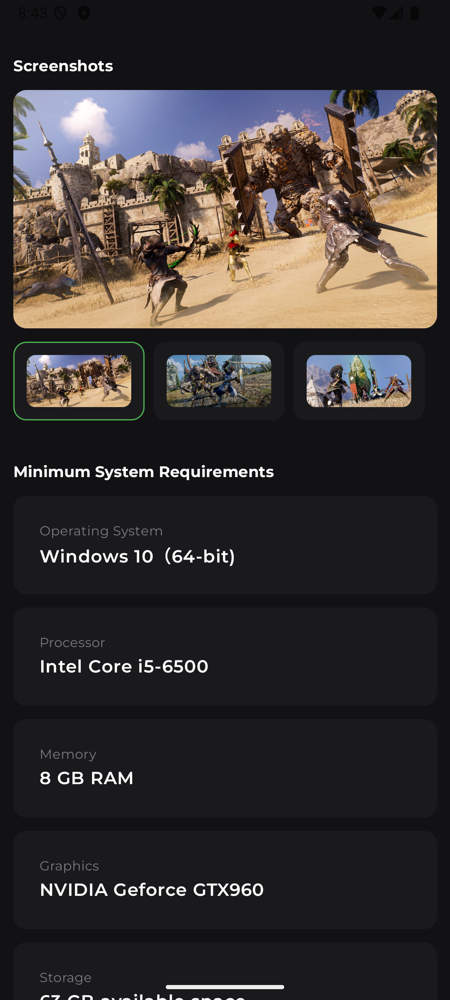

  

<h1 align="center">DeepLink Launcher</h1>

  DeepLink Launcher is a Compose Multiplatform app designed for executing and managing deeplinks. This tool offers developers and QA teams an intuitive interface for testing, organizing, tracking, and sharing deeplinks.

  
  

## Screenshot

## Features

- **Execute Deeplinks**: Instantly execute deeplinks on Android, iOS, and Desktop platforms.
- **Device Bridge**: The Desktop app integrates with **ADB** (Android) and **Xcrun** (iOS) to run deeplinks directly on devices in real-time.
- **Auto-suggestions**: Suggests deeplinks based on your usage history and clipboard content.
- **Deeplink History**: Easily track and revisit all previously executed deeplinks.
- **Favorites**: Mark your most used deeplinks as favorites for quick access.
- **Folders**: Organize your deeplinks into folders for better management.
- **Export/Import**: Export and share your deeplinks in **JSON** or **TXT** formats. Import deeplinks as needed.
- **Duplicate Deeplinks**: Quickly duplicate existing deeplinks to save time on similar or recurring tasks.
- **Theme Support**: Choose between Light and Dark themes to match your preferences.
- **Search**: Find any deeplink fast with the built-in search functionality.
- **In-App Purchase**: Support the project by buying a coffee (Android only).

## Built With

| Technology | Description |
|------------|-------------|
| [**Compose Multiplatform**](https://github.com/JetBrains/compose-jb) | A modern UI toolkit for building native UIs across all platforms. |
| [**Voyager**](https://github.com/adrielcafe/voyager) | A multiplatform navigation library. |
| [**Koin**](https://insert-koin.io/) | A powerful dependency injection framework for Kotlin. |
| [**SQLDelight**](https://cashapp.github.io/sqldelight/) | A multiplatform database library that generates type-safe Kotlin APIs. |
| [**DataStore**](https://developer.android.com/jetpack/androidx/releases/datastore) | A modern data storage solution for key-value pairs or protocol buffers with Kotlin coroutines. |
| [**Material3**](https://m3.material.io/) | Google's design system for a consistent user experience across platforms. |
| [**Kotlinx Immutable**](https://github.com/Kotlin/kotlinx.collections.immutable) | Immutable collections for Kotlin. |
| [**Kotlinx DateTime**](https://github.com/Kotlin/kotlinx-datetime) | Library for working with date and time in Kotlin. |
| [**AboutLibraries**](https://github.com/mikepenz/AboutLibraries) | Displays open-source libraries used in Android apps. |
| [**Detekt**](https://github.com/detekt/detekt) | A static code analysis tool for Kotlin. |
| [**Ktlint**](https://github.com/pinterest/ktlint) | A Kotlin linter for enforcing code style guidelines. |
| [**MPFilePicker**](https://github.com/Wavesonics/compose-multiplatform-file-picker) | A multiplatform file picker for Compose. |
| [**Material 3 Window Size Class**](https://github.com/chrisbanes/material3-windowsizeclass-multiplatform) | A library to detect window size across different platforms. |
| [**RevenueCat**](https://www.revenuecat.com/) | In-app purchase library for managing subscriptions and one-time purchases. |

Feel free to reach out with any questions or suggestions! 😄
