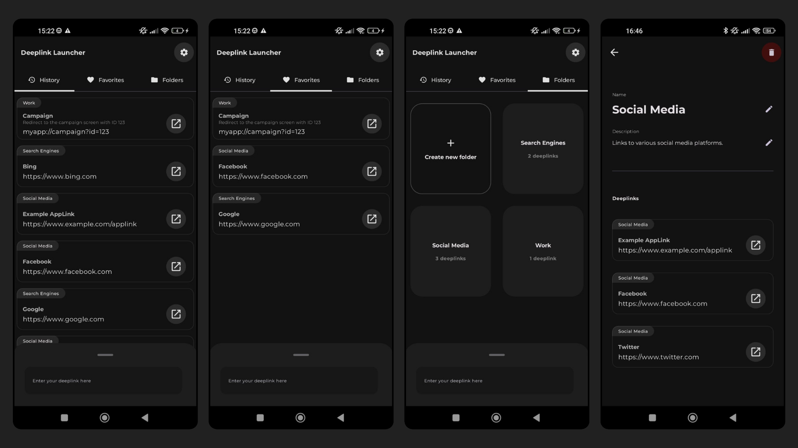
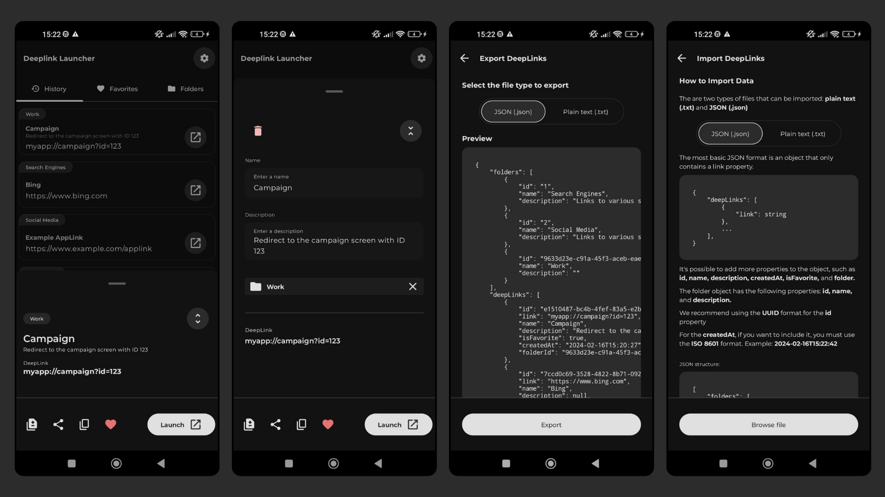

# DeepLink Launcher

DeepLink Launcher streamlines the management of deeplinks for developers and QA. Featuring a user-friendly interface built on Compose Multiplatform and Material3, it simplifies executing, organizing, tracking, and sharing deeplinks.

## Screenshots

## Features
- [x] **Execute Deeplinks**: Quickly and easily execute deeplinks.
- [x] **Deeplink History**: Track all executed deeplinks.
- [x] **Favorites**: Mark deeplinks as favorites for quick access.
- [x] **Folders**: Organize deeplinks into folders for efficient management.
- [x] **Export/Import**: Share or backup deeplinks and folders in JSON or TXT formats.
- [x] **Duplicate DeepLink**: Easily duplicate existing deeplinks, saving time when creating similar entries or variations.
- [x] **Theme Support**: Customize your experience by switching between Light and Dark modes
- [x] **Search**: Quickly find deeplinks by searching for keywords.
- [ ] **Google Drive**: Backup your deeplinks and folders with Google Drive.
- [ ] **Internationalization**: Starting with Portuguese (Brazil)

## Multiplatform

Currently, DeepLink Launcher is available only on **Android**. However, since I developed the app entirely with **Compose Multiplatform**, I plan to soon launch the **iOS** app and develop for **Desktop**! Stay tuned!

## Built With

- **MVVM**
- **[Compose Multiplatform](https://github.com/JetBrains/compose-jb)**
- **[Voyager](https://github.com/adrielcafe/voyager)**
- **[Koin](https://insert-koin.io/)**
- **[SQLDelight](https://cashapp.github.io/sqldelight/)**
- **[DataStore](https://developer.android.com/jetpack/androidx/releases/datastore)**
- **[Material3](https://m3.material.io/)**
- **[Kotlinx Immutable](https://github.com/Kotlin/kotlinx.collections.immutable)**
- **[Kotlinx DateTime](https://github.com/Kotlin/kotlinx-datetime)**
- **[AboutLibraries](https://github.com/mikepenz/AboutLibraries)**
- **[Detekt](https://github.com/detekt/detekt)**
- **[Ktlint](https://github.com/pinterest/ktlint)**
- **Moko [Resources](https://github.com/icerockdev/moko-resources) & [Permissions](https://github.com/icerockdev/moko-permissions)**
