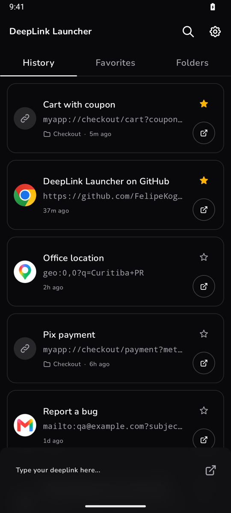
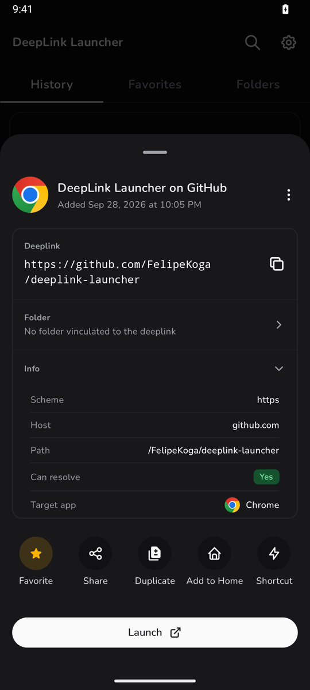
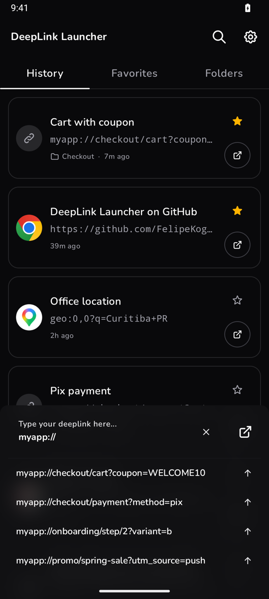
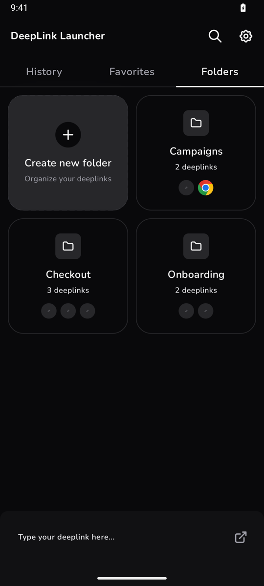
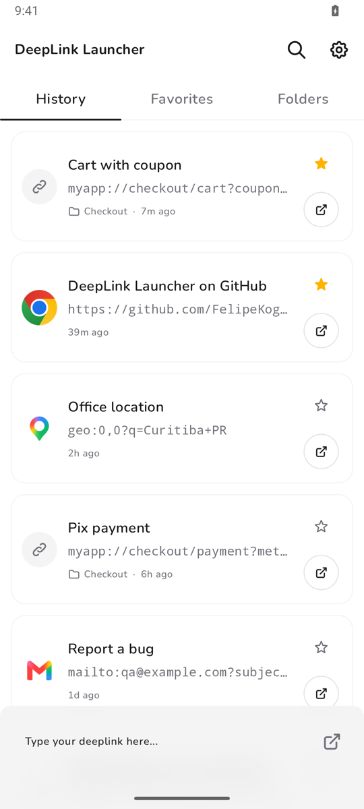
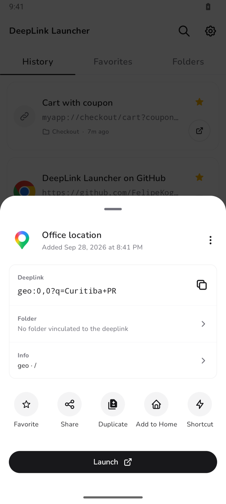
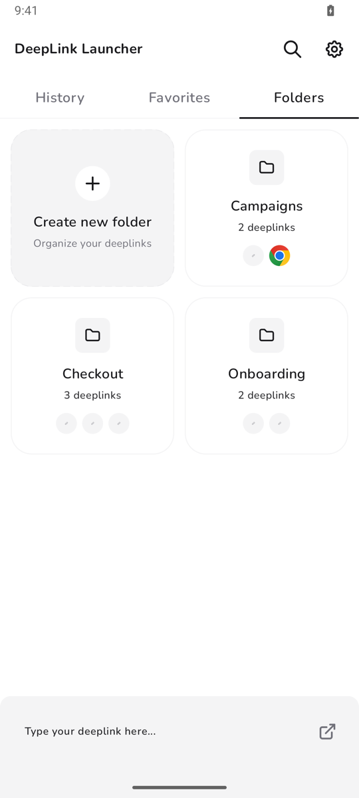
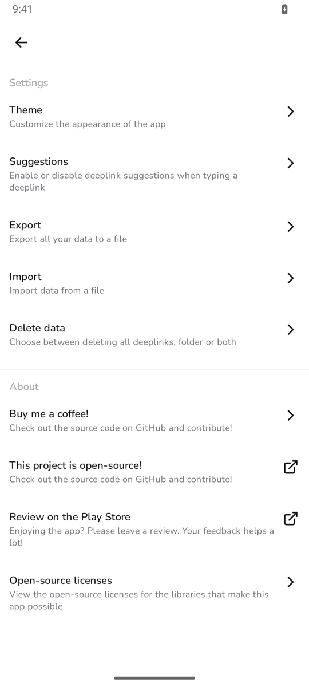
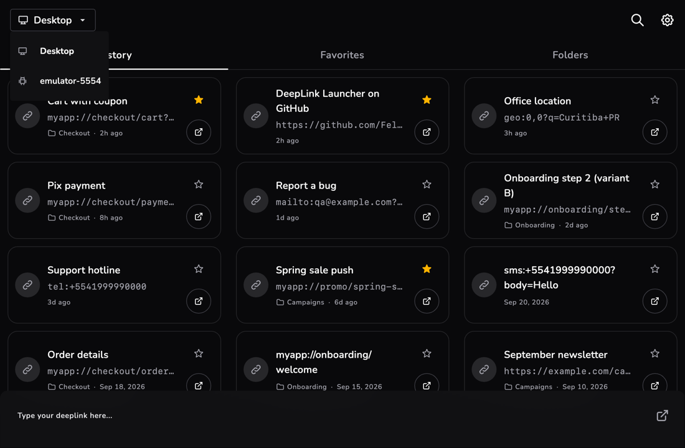
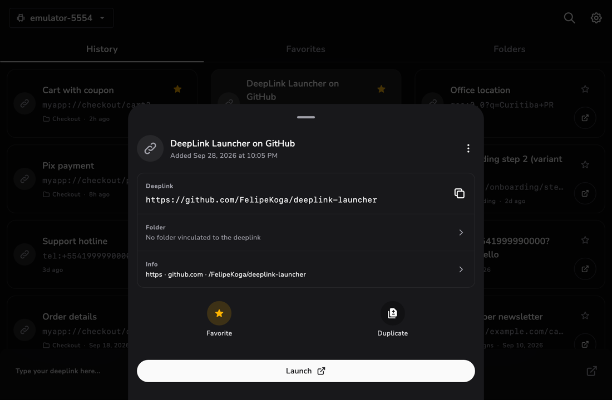

<p align="center">
  
</p>

<h1 align="center">DeepLink Launcher</h1>

<p align="center">
  A deeplink launcher and organizer for Android, iOS and desktop.
</p>

<p align="center">
  <a href="https://play.google.com/store/apps/details?id=dev.koga.deeplinklauncher.android"></a>
  <a href="https://github.com/FelipeKoga/deeplink-launcher/releases/latest"></a>
</p>

For developers and QA who test deeplinks.

## Screenshots

<table>
  <tr>
    <th colspan="4">Android · dark</th>
  </tr>
  <tr>
    <td align="center"><br /><sub>History</sub></td>
    <td align="center"><br /><sub>Link details</sub></td>
    <td align="center"><br /><sub>Suggestions</sub></td>
    <td align="center"><br /><sub>Folders</sub></td>
  </tr>
  <tr>
    <th colspan="4">Android · light</th>
  </tr>
  <tr>
    <td align="center"><br /><sub>History</sub></td>
    <td align="center"><br /><sub>Quick actions</sub></td>
    <td align="center"><br /><sub>Folders</sub></td>
    <td align="center"><br /><sub>Settings</sub></td>
  </tr>
</table>

<table>
  <tr>
    <th colspan="2">Desktop</th>
  </tr>
  <tr>
    <td align="center"><br /><sub>Launch on this computer or a connected device</sub></td>
    <td align="center"><br /><sub>Link details</sub></td>
  </tr>
</table>

<!--
Android screenshots: emulator (Medium Phone API 35), debug build. The data comes from
docs/screenshots/seed-deeplinks.json, imported through Settings > Import. Captured with
agent-device (screenshot with a normalized status bar), then resized with `sips -Z 1200`.

Desktop screenshots: the desktop App() rendered offscreen with ImageComposeScene at 1100x720 dp
and density 2, with the Android database copied into an isolated user.home and an emulator
connected over adb. Resized with `sips -Z 1100`.
-->

## Features

- Launch any deeplink or URL from the input bar
- Suggestions from your history as you type
- Suggests the deeplink on your clipboard (Android, desktop), or offers the system Paste button for it (iOS)
- History sorted by last launch, with search
- Favorites and folders
- Edit and duplicate links, with a name and notes
- Link details: scheme, host, path and query
- Shows which app opens a link and lets you pick one when several can (Android)
- App shortcuts and home screen pins (Android)
- Send links to a connected Android device or a booted iOS simulator (desktop)
- Copy a link, or share it (Android, iOS)
- Import and export as JSON or plain text
- Light and dark theme
- Donate to support the project (Android)

## Download

- Android: [Google Play](https://play.google.com/store/apps/details?id=dev.koga.deeplinklauncher.android)
- Desktop: [GitHub releases](https://github.com/FelipeKoga/deeplink-launcher/releases/latest) (DMG for macOS, EXE for Windows, DEB for Debian and Ubuntu)
- iOS: not on the App Store yet; build it from `iosApp/` with Xcode

## Tech stack

- Kotlin Multiplatform
- Compose Multiplatform, Material 3
- Navigation Compose
- Koin
- SQLDelight
- DataStore
- kotlinx.coroutines, kotlinx.serialization, kotlinx-datetime, kotlinx-collections-immutable
- Haze, Tabler Icons
- mpfilepicker
- AboutLibraries
- Firebase (Analytics, Crashlytics, Performance)
- RevenueCat
- ktlint, Detekt

## Tests

- Unit tests
- Screenshot tests with Roborazzi
- End-to-end tests with Maestro

## Building

You need JDK 17 and an Android Studio version that supports AGP 8.13. Xcode is only needed for the iOS app.

Create the local config files first:

```bash
cp env.properties.example env.properties
cp keystore.properties.example keystore.properties
```

The Android build also needs a Firebase config at `androidApp/google-services.json`. Register the package `dev.koga.deeplinklauncher.android` in your own Firebase project to get one.

```bash
./gradlew :androidApp:installDebug   # Android device or emulator
./gradlew :desktopApp:run            # desktop
```

For iOS, open `iosApp/deeplinklauncher.xcodeproj` in Xcode and run the app.

## Docs

- [Design system](docs/DESIGN_SYSTEM.md)
- [Analytics](docs/ANALYTICS.md)
- [Privacy policy](PRIVACY_POLICY.md)

## Contributing

Issues and pull requests are welcome. For anything bigger than a small fix, open an issue first. Commit messages follow Conventional Commits (`feat:`, `fix:`, `perf:` and so on), branch names start with the same type (`feat/`, `fix/`), and `./gradlew ktlint` should pass before you open a pull request.

## License

Apache 2.0. See [LICENSE](LICENSE).
