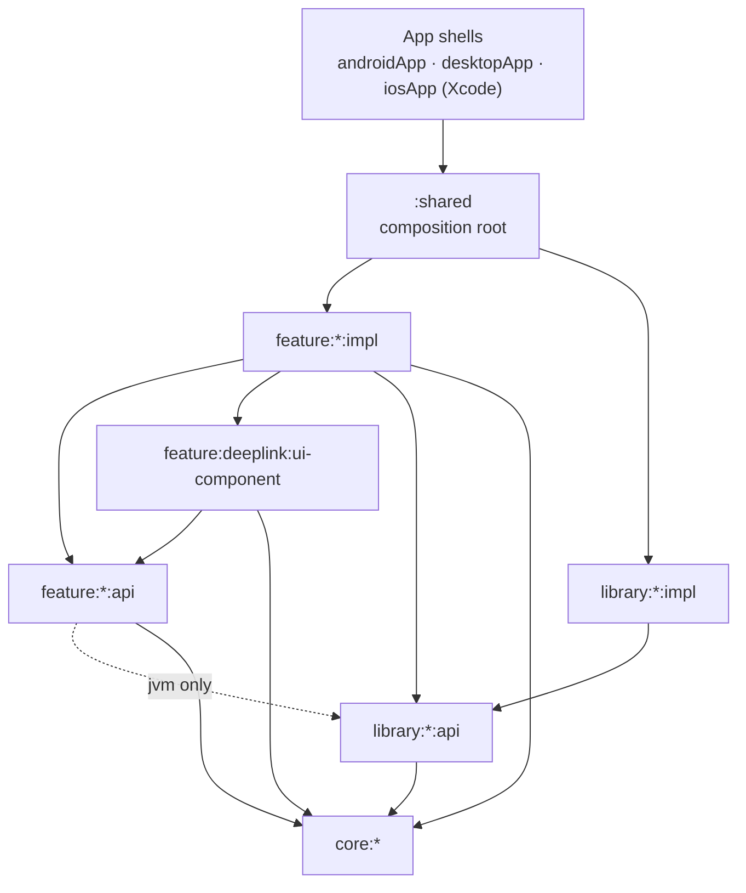

<p align="center">
  
</p>

<h1 align="center">DeepLink Launcher</h1>

<p align="center">
  A deeplink launcher and organizer for Android, iOS and desktop.
</p>

<p align="center">
  <a href="https://play.google.com/store/apps/details?id=dev.koga.deeplinklauncher.android"></a>
  <a href="https://github.com/FelipeKoga/deeplink-launcher/releases/latest"></a>
  <a href="https://github.com/FelipeKoga/deeplink-launcher/actions/workflows/maestro.yml"></a>
  <a href="https://github.com/FelipeKoga/deeplink-launcher/actions/workflows/screenshot-baseline.yml"></a>
</p>

DeepLink Launcher is for developers and QA who test deeplinks. You paste or type a link, launch it, and it stays in a history you can search, favorite and sort into folders. On desktop the app can also send the link to a connected Android device or a booted iOS simulator, running `adb shell am start` or `xcrun simctl openurl` for you.

It's one Compose Multiplatform codebase. The UI, the data layer and almost all of the logic are shared, and platform code is limited to things like firing an `Intent` on Android or calling `adb` on desktop.

<p align="center">
  
  
  
  
</p>
<p align="center">
  
  
  
  
</p>

<!--
Screenshots: Android emulator (Medium Phone API 35), debug build. The data comes from
docs/screenshots/seed-deeplinks.json, imported through Settings > Import. Captured with
agent-device (screenshot with a normalized status bar), then resized with `sips -Z 1200`.
-->

## Download

- Android: [Google Play](https://play.google.com/store/apps/details?id=dev.koga.deeplinklauncher.android).
- Desktop: [latest GitHub release](https://github.com/FelipeKoga/deeplink-launcher/releases/latest), with a DMG for macOS, an EXE for Windows and a DEB for Debian and Ubuntu.
- iOS: not on the App Store. You can build it from `iosApp/` with Xcode.

## What it does

- Type or paste a link in the bottom bar and launch it. While you type, the bar suggests schemes and then matching links from your history. When the bar is empty and the clipboard holds something that looks like a deeplink, that link is the first suggestion.
- Every launched link is saved, and History is ordered by the last launch. You can search it, mark favorites, move links into folders, give them a name and notes, or duplicate one with a different URL.
- The details sheet splits the link into scheme, host, path and query. On Android it also says whether an installed app can open the link, and when more than one can, you choose which one it goes to.
- Android can also turn a link into an app shortcut or pin it to the home screen.
- The desktop app has a dropdown in the top bar that picks where links go: the computer itself, a connected Android device or emulator, or a booted iOS simulator.
- Export and import use JSON, which keeps names, notes, favorites and folders, or plain text with one link per line.

Android has the full feature set. iOS shares the UI and the database, but it has no clipboard suggestions, app shortcuts, home screen pins, handler info or target app picker yet. The desktop app has the device bridge and clipboard suggestions, lacks the shortcut, pin and handler features, and its "share" copies the link to the clipboard. The donation screen (RevenueCat) and analytics (Firebase) only exist on Android; iOS and desktop bind no-op implementations.

## Architecture

The Android app (`androidApp`) and the desktop app (`desktopApp`) are thin Gradle modules. The iOS app is the Xcode project in `iosApp/`, which embeds the `shared` framework. Almost everything else is Kotlin Multiplatform, compiled for Android, JVM and three iOS targets. The exceptions are `library:device-bridge`, a plain JVM library used only by the desktop app, and `baselineprofile`, an Android test module.

The home, details, folder details and link-to-folder screens use the same pattern. The ViewModel exposes a single `StateFlow` of UI state, built with `combine(...).stateIn(...)`, and receives a sealed interface of actions through one `onAction()` function. ViewModels never see a `NavController`: they send `@Serializable` routes to an `AppNavigator`, and `App.kt` collects them and drives the `NavHost`. Navigation and snackbars go through app-wide `Channel`s (`AppNavigator` and `SnackBarDispatcher`). The settings and import/export ViewModels are simpler, with public functions instead of an action interface.

Modules that need bindings declare a Koin module in their `di` package. Anything that depends on the platform, such as launching, sharing, shortcuts or the database driver, is an interface in common code (or an `expect` class, in the case of the clipboard reader) with an Android, iOS or JVM implementation bound in a per-platform Koin module. Deeplinks and folders are stored with SQLDelight and preferences with DataStore.

Launching a link from the input bar goes through these steps:

1. The launch button in [`DeepLinkLaunchBottomBar`](feature/deeplink/ui-component/src/commonMain/kotlin/dev/koga/deeplinklauncher/deeplink/uicomponent/DeepLinkLaunchBottomBar.kt) calls its `launch` callback, which `HomeScreen` turns into `HomeAction.LaunchInputDeepLink` for [`HomeViewModel`](feature/home/impl/src/commonMain/kotlin/dev/koga/deeplinklauncher/home/impl/ui/HomeViewModel.kt).
2. The ViewModel checks whether the link is already saved and calls [`LaunchDeepLink`](feature/deeplink/api/src/commonMain/kotlin/dev/koga/deeplinklauncher/deeplink/api/domain/usecase/LaunchDeepLink.kt), an interface from `feature:deeplink:api`.
3. `feature:deeplink:impl` has one implementation per platform. [Android](feature/deeplink/impl/src/androidMain/kotlin/dev/koga/deeplinklauncher/deeplink/impl/domain/usecase/LaunchDeepLinkImpl.android.kt) fires a `VIEW` intent, locked to the chosen app if there is one. [iOS](feature/deeplink/impl/src/iosMain/kotlin/dev/koga/deeplinklauncher/deeplink/impl/domain/usecase/LaunchDeepLinkImpl.ios.kt) calls `UIApplication.openURL`. [Desktop](feature/deeplink/impl/src/jvmMain/kotlin/dev/koga/deeplinklauncher/deeplink/impl/domain/usecase/LaunchDeepLinkImpl.jvm.kt) uses `Desktop.browse` or the device bridge, depending on the selected target.
4. A new link that opened is inserted with `lastLaunchedAt` set to now. For a saved link, the implementation runs `updateLastLaunchedAt` from [`DeepLink.sq`](core/database/src/commonMain/sqldelight/dev/koga/deeplinklauncher/database/DeepLink.sq), an `UPDATE` of that one column. The SQLDelight query flow then moves the link to the top of History.

## Modules

There are 30 Gradle modules, plus the `build-logic` included build.


```mermaid
graph TD
  shells["App shells<br/>androidApp · desktopApp · iosApp (Xcode)"]
  shared[":shared<br/>composition root"]
  fimpl["feature:*:impl"]
  fui["feature:deeplink:ui-component"]
  fapi["feature:*:api"]
  limpl["library:*:impl"]
  lapi["library:*:api"]
  core["core:*"]

  shells --> shared
  shared --> fimpl
  shared --> limpl
  fimpl --> fapi
  fimpl --> fui
  fui --> fapi
  fimpl --> lapi
  fapi -. "jvm only" .-> lapi
  limpl --> lapi
  lapi --> core
  fimpl --> core
  fui --> core
  fapi --> core
```

| Group | Modules | What lives there |
|---|---|---|
| Shells | `androidApp`, `desktopApp`, `iosApp` (Xcode) | Entry points, signing, R8, desktop installers |
| Composition root | `shared` | Starts Koin with every module, builds the `NavHost` from each feature's `NavigationGraph`, produces the iOS framework |
| Features | `home`, `deeplink`, `data-transfer`, `settings`, each split into `api` and `impl`, plus `deeplink:ui-component` | Screens, ViewModels, use cases and repositories |
| Libraries | `analytics`, `purchase`, `device-bridge`, each split into `api` and `impl` | Firebase, RevenueCat and the ADB/`simctl` bridge, behind interfaces |
| Core | `coroutines`, `database`, `date`, `designsystem`, `file`, `navigation`, `platform`, `preferences`, `resources`, `ui`, `ui-event` | Shared infrastructure and the design system |
| Performance | `baselineprofile` | Baseline profile generator and startup benchmark |

A feature's `impl` can depend on its own `api`, on other features' `api` modules, on `feature:deeplink:ui-component`, on the `library:*:api` modules and on `core`. It never depends on another `impl`; only `:shared` sees the `impl` modules. Feature `api` modules use `explicitApi()` and hold contracts: models, repository and use-case interfaces, and navigation routes. [docs/MODULARIZATION.md](docs/MODULARIZATION.md) has the package layout and the steps for adding a feature.

### Build logic

The convention plugins in [`build-logic`](build-logic/src/main/kotlin) keep the module build files short:

- `dev.koga.deeplinklauncher.multiplatform` sets up the five targets, JDK 17, a `mobileMain` source set shared by Android and iOS, and a namespace derived from the module path.
- `dev.koga.deeplinklauncher.compose-multiplatform` adds the Compose compiler and the common UI dependencies.
- `dev.koga.deeplinklauncher.screenshot-testing` adds Roborazzi and generates the screenshot tests.
- `dev.koga.deeplinklauncher.code-analysis` adds ktlint and Detekt with the Twitter Compose rules.

Versions live in [`gradle/libs.versions.toml`](gradle/libs.versions.toml), and Renovate opens the update PRs.

## Tech stack

| Area | Libraries | Used for |
|---|---|---|
| UI | Compose Multiplatform 1.10, Material 3, Haze, Tabler Icons | The shared UI on every target, and the blur behind the top and bottom bars |
| Navigation | JetBrains navigation-compose 2.9, navigationevent | Type-safe routes, bottom sheets as dialog destinations, back handling inside the details sheet |
| DI | Koin 4.1 | Per-module wiring and per-platform bindings |
| Storage | SQLDelight 2.2, DataStore 1.2 | Deeplinks and folders; theme and suggestion settings |
| Kotlin | Coroutines, Serialization, kotlinx-datetime, immutable collections | Flows everywhere, JSON import and export, dates stored as epoch millis |
| Files | mpfilepicker | Picking the file to import on every platform |
| Android | Firebase Analytics, Crashlytics and Performance, RevenueCat, splash screen, profileinstaller | Crash and usage reporting, the donation screen, startup |
| Desktop | Compose Desktop packaging | DMG, EXE and DEB installers |
| Quality | ktlint, Detekt, Compose Stability Analyzer | Formatting, static analysis, recomposition checks |
| Testing | Roborazzi, Robolectric, ComposablePreviewScanner, Maestro, Macrobenchmark | Screenshot tests, end-to-end flows, startup benchmark |

## Tests

### Screenshot tests

The `screenshot-testing` convention uses Roborazzi with ComposablePreviewScanner to generate one Robolectric test per `@Preview` in the module's package. Each test renders on SDK 35 with Pixel 5 qualifiers, in English and in UTC, so the output doesn't depend on the machine. That is 264 images: 105 previews in light and dark, plus 9 full-screen previews at six screen sizes. One preview whose content changes with every dependency update is excluded with `@RoboPreviewExclude`.

The reference images aren't committed. `screenshot-baseline.yml` records them on `main` and keeps them as a workflow artifact, and `screenshot-tests.yml` compares each pull request against the latest one. When an image changed, the job fails and uploads the diffs, and it stays red until someone reviews them and adds the `screenshots-approved` label.

```bash
./gradlew recordRoborazziDebug   # writes images to <module>/build/outputs/roborazzi
./gradlew compareRoborazziDebug  # writes *_compare.png diffs and never fails
./gradlew verifyRoborazziDebug   # fails on any difference
```

CI renders on Linux, so compare a local run against a local recording rather than against the CI artifact.

### End-to-end tests

The 16 [Maestro](https://maestro.mobile.dev) flows in [`maestro/flows`](maestro/flows) cover creating and launching links, editing, favorites, search, folders, duplicating and deleting, settings, back navigation inside the details sheet, app shortcuts, clipboard suggestions and the History order. Each flow starts from a cleared app state. `maestro.yml` runs them on an API 34 emulator and uploads screenshots, the view hierarchy and logcat for any flow that fails. Locally, with an emulator running the debug build:

```bash
maestro test maestro/
```

### Unit tests

JVM unit tests cover the `adb` and `simctl` output parsers in `library:device-bridge:impl` and where the desktop app stores its data in `core:platform`. The pull request workflow doesn't run them yet:

```bash
./gradlew :library:device-bridge:impl:test :core:platform:jvmTest
```

## Performance

`:baselineprofile` generates the startup baseline profile for the Android app and has a cold-start macrobenchmark:

```bash
./gradlew :androidApp:generateBaselineProfile
```

On the home list, handler lookups are cached per link. The first rows get their handler app and icon and are shown before the rest of the list, and rows that didn't change keep the same instance, so their cards skip recomposition. Suggestions are only computed while the input bar is open. The launch is recorded after the link opens, and the bar blur runs at a lower input scale. These changes came in [#314](https://github.com/FelipeKoga/deeplink-launcher/pull/314) to [#318](https://github.com/FelipeKoga/deeplink-launcher/pull/318).

## CI

| Workflow | Runs on | What it does |
|---|---|---|
| [`pull-request.yml`](.github/workflows/pull-request.yml) | Pull requests to `main` | `testDebugUnitTest` (screenshot tests excluded) and ktlint |
| [`screenshot-tests.yml`](.github/workflows/screenshot-tests.yml) | Pull requests to `main` | Compares screenshots with the `main` baseline |
| [`screenshot-baseline.yml`](.github/workflows/screenshot-baseline.yml) | Pushes to `main`, weekly, manual | Records the screenshot baseline |
| [`maestro.yml`](.github/workflows/maestro.yml) | Pushes to `main`, nightly, manual | Runs the Maestro flows on an emulator |
| [`release.yml`](.github/workflows/release.yml) | Manual, with a tag name | Builds the signed APK, DMG, EXE and DEB and publishes a GitHub release |

## Building

You need JDK 17 and an Android Studio version that supports AGP 8.13. Xcode is only needed for the iOS app.

Create the local config files first:

```bash
cp env.properties.example env.properties
cp keystore.properties.example keystore.properties
```

`keystore.properties.example` points to the test keystore committed at `androidApp/dll-testing.jks`, and `env.properties` holds the RevenueCat API key used by the donation screen. The Android build also needs a Firebase config at `androidApp/google-services.json`; the Google Services plugin fails the build without it. Register the package `dev.koga.deeplinklauncher.android` in your own Firebase project to get one.

```bash
./gradlew :androidApp:installDebug   # Android device or emulator
./gradlew :desktopApp:run            # desktop
```

For iOS, open `iosApp/deeplinklauncher.xcodeproj` in Xcode and run the app. A build phase compiles the `shared` framework through Gradle.

## Docs

- [docs/MODULARIZATION.md](docs/MODULARIZATION.md): module types, what goes in `api` and `impl`, dependency rules.
- [docs/DESIGN_SYSTEM.md](docs/DESIGN_SYSTEM.md): the `DeepLinkTheme` tokens and the `DLL*` components.
- [docs/ANALYTICS.md](docs/ANALYTICS.md): tracked events, screen names and what is never sent.
- [PRIVACY_POLICY.md](PRIVACY_POLICY.md)

## Contributing

Issues and pull requests are welcome. For anything bigger than a small fix, open an issue first so we can agree on the approach. Commit messages follow Conventional Commits (`feat:`, `fix:`, `perf:` and so on), branch names start with the same type (`feat/`, `fix/`, `perf/`), and `./gradlew ktlint` should pass before you open a pull request.

## License

Apache 2.0. See [LICENSE](LICENSE).
