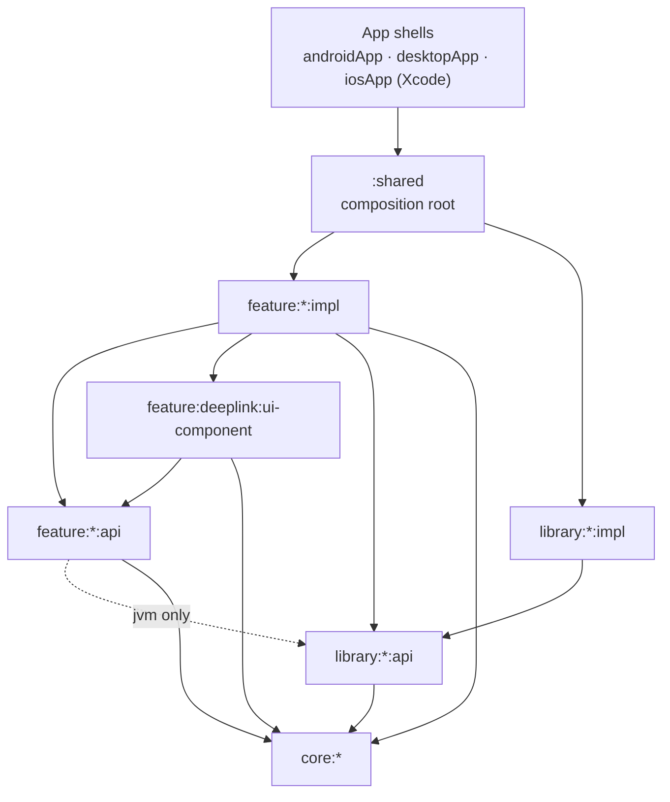

<p align="center">
  
</p>

<h1 align="center">DeepLink Launcher</h1>

<p align="center">
  A deeplink launcher and organizer for Android, iOS and desktop.
</p>

<p align="center">
  <a href="https://play.google.com/store/apps/details?id=dev.koga.deeplinklauncher.android"></a>
  <a href="https://github.com/FelipeKoga/deeplink-launcher/releases/latest"></a>
  <a href="https://github.com/FelipeKoga/deeplink-launcher/actions/workflows/maestro.yml"></a>
  <a href="https://github.com/FelipeKoga/deeplink-launcher/actions/workflows/ios.yml"></a>
  <a href="https://github.com/FelipeKoga/deeplink-launcher/actions/workflows/screenshot-baseline.yml"></a>
</p>

For developers and QA who test deeplinks. Built with Compose Multiplatform for Android, iOS and desktop.

<p align="center">
  
  
  
  
</p>
<p align="center">
  
  
  
  
</p>
<p align="center">
  
  
</p>

<!--
Android screenshots: emulator (Medium Phone API 35), debug build. The data comes from
docs/screenshots/seed-deeplinks.json, imported through Settings > Import. Captured with
agent-device (screenshot with a normalized status bar), then resized with `sips -Z 1200`.

Desktop screenshots: the desktop App() rendered offscreen with ImageComposeScene at 1100x720 dp
and density 2, with the Android database copied into an isolated user.home and an emulator
connected over adb. Resized with `sips -Z 1100`.
-->

## What it does

- Launch any deeplink or URL from the input bar
- Suggestions from your history as you type
- Suggests the deeplink on your clipboard (Android, desktop), or offers the system Paste button for it (iOS)
- History sorted by last launch, with search
- Favorites and folders
- Name, notes, edit and duplicate links
- Link details: scheme, host, path and query
- Shows which app opens a link and lets you pick one when several can (Android)
- App shortcuts and home screen pins (Android)
- Send links to a connected Android device or a booted iOS simulator (desktop)
- Share a link (on desktop it copies it to the clipboard)
- Import and export as JSON or plain text
- Light and dark theme
- Donate to support the project (Android)

## Download

- Android: [Google Play](https://play.google.com/store/apps/details?id=dev.koga.deeplinklauncher.android)
- Desktop: [GitHub releases](https://github.com/FelipeKoga/deeplink-launcher/releases/latest) (DMG for macOS, EXE for Windows, DEB for Debian and Ubuntu)
- iOS: not on the App Store yet; build it from `iosApp/` with Xcode

## Modules

There are 30 Gradle modules, plus the `build-logic` included build.


```mermaid
graph TD
  shells["App shells<br/>androidApp · desktopApp · iosApp (Xcode)"]
  shared[":shared<br/>composition root"]
  fimpl["feature:*:impl"]
  fui["feature:deeplink:ui-component"]
  fapi["feature:*:api"]
  limpl["library:*:impl"]
  lapi["library:*:api"]
  core["core:*"]

  shells --> shared
  shared --> fimpl
  shared --> limpl
  fimpl --> fapi
  fimpl --> fui
  fui --> fapi
  fimpl --> lapi
  fapi -. "jvm only" .-> lapi
  limpl --> lapi
  lapi --> core
  fimpl --> core
  fui --> core
  fapi --> core
```

| Group | Modules | What lives there |
|---|---|---|
| Shells | `androidApp`, `desktopApp`, `iosApp` (Xcode) | Entry points, signing, R8, desktop installers |
| Composition root | `shared` | Starts Koin with every module, builds the `NavHost` from each feature's `NavigationGraph`, produces the iOS framework |
| Features | `home`, `deeplink`, `data-transfer`, `settings`, each split into `api` and `impl`, plus `deeplink:ui-component` | Screens, ViewModels, use cases and repositories |
| Libraries | `analytics`, `purchase`, `device-bridge`, each split into `api` and `impl` | Firebase, RevenueCat and the ADB/`simctl` bridge, behind interfaces |
| Core | `coroutines`, `database`, `date`, `designsystem`, `file`, `navigation`, `platform`, `preferences`, `resources`, `ui`, `ui-event` | Shared infrastructure and the design system |
| Performance | `baselineprofile` | Baseline profile generator and startup benchmark |

A feature's `impl` can depend on its own `api`, on other features' `api` modules, on `feature:deeplink:ui-component`, on the `library:*:api` modules and on `core`. It never depends on another `impl`; only `:shared` sees the `impl` modules. Feature `api` modules use `explicitApi()` and hold contracts: models, repository and use-case interfaces, and navigation routes. [docs/MODULARIZATION.md](docs/MODULARIZATION.md) has the package layout and the steps for adding a feature.

### Build logic

The convention plugins in [`build-logic`](build-logic/src/main/kotlin) keep the module build files short:

- `dev.koga.deeplinklauncher.multiplatform` sets up the five targets, JDK 17, a `mobileMain` source set shared by Android and iOS, and a namespace derived from the module path.
- `dev.koga.deeplinklauncher.compose-multiplatform` adds the Compose compiler and the common UI dependencies.
- `dev.koga.deeplinklauncher.screenshot-testing` adds Roborazzi and generates the screenshot tests.
- `dev.koga.deeplinklauncher.code-analysis` adds ktlint and Detekt with the Twitter Compose rules.

Versions live in [`gradle/libs.versions.toml`](gradle/libs.versions.toml), and Renovate opens the update PRs.

## Tech stack

| Area | Libraries | Used for |
|---|---|---|
| UI | Compose Multiplatform 1.10, Material 3, Haze, Tabler Icons | The shared UI on every target, and the blur behind the top and bottom bars |
| Navigation | JetBrains navigation-compose 2.9, navigationevent | Type-safe routes, bottom sheets as dialog destinations, back handling inside the details sheet |
| DI | Koin 4.1 | Per-module wiring and per-platform bindings |
| Storage | SQLDelight 2.2, DataStore 1.2 | Deeplinks and folders; theme and suggestion settings |
| Kotlin | Coroutines, Serialization, kotlinx-datetime, immutable collections | Flows everywhere, JSON import and export, dates stored as epoch millis |
| Files | mpfilepicker | Picking the file to import on every platform |
| Android | Firebase Analytics, Crashlytics and Performance, RevenueCat, splash screen, profileinstaller | Crash and usage reporting, the donation screen, startup |
| Desktop | Compose Desktop packaging | DMG, EXE and DEB installers |
| Quality | ktlint, Detekt, Compose Stability Analyzer | Formatting, static analysis, recomposition checks |
| Testing | Roborazzi, Robolectric, ComposablePreviewScanner, Maestro, Macrobenchmark | Screenshot tests, end-to-end flows, startup benchmark |

## Tests

### Screenshot tests

The `screenshot-testing` convention uses Roborazzi with ComposablePreviewScanner to generate one Robolectric test per `@Preview` in the module's package. Each test renders on SDK 35 with Pixel 5 qualifiers, in English and in UTC, so the output doesn't depend on the machine. That is 264 images: 105 previews in light and dark, plus 9 full-screen previews at six screen sizes. One preview whose content changes with every dependency update is excluded with `@RoboPreviewExclude`.

The reference images aren't committed. `screenshot-baseline.yml` records them on `main` and keeps them as a workflow artifact, and `screenshot-tests.yml` compares each pull request against the latest one. When an image changed, the job fails and uploads the diffs, and it stays red until someone reviews them and adds the `screenshots-approved` label.

```bash
./gradlew recordRoborazziDebug   # writes images to <module>/build/outputs/roborazzi
./gradlew compareRoborazziDebug  # writes *_compare.png diffs and never fails
./gradlew verifyRoborazziDebug   # fails on any difference
```

CI renders on Linux, so compare a local run against a local recording rather than against the CI artifact.

### End-to-end tests

The 16 [Maestro](https://maestro.mobile.dev) flows in [`maestro/flows`](maestro/flows) cover creating and launching links, editing, favorites, search, folders, duplicating and deleting, settings, back navigation inside the details sheet, app shortcuts, clipboard suggestions and the History order. Each flow starts from a cleared app state. `maestro.yml` runs them on an API 34 emulator and uploads screenshots, the view hierarchy and logcat for any flow that fails. Locally, with an emulator running the debug build:

```bash
maestro test maestro/
```

On iOS, `ios.yml` builds the app for a simulator, launches it and runs the flow in [`maestro/ios`](maestro/ios), which pastes a deeplink with the system Paste button.

### Unit tests

Unit tests cover:

- **`library:device-bridge:impl`:** the `adb` and `simctl` bridges.
- **`core:platform`:** where the desktop app stores its data.
- **`core:database`:** the upgrade of databases from older desktop versions and from every schema snapshot.
- **`feature:deeplink:impl` (Robolectric):** Add to Home and app shortcuts with data that older versions could store.

The pull request workflow runs them:

```bash
./gradlew testDebugUnitTest jvmTest :library:device-bridge:impl:test -PexcludeScreenshotTests
```

`jvmTest` first runs `verifySqlDelightMigration`. It applies every migration to the schema snapshots in `core/database/src/commonMain/sqldelight/databases` and compares the result with a fresh database, so a `.sq` change without a migration fails the build. To change the schema:

1. Add the next `N.sqm`.
2. Regenerate the snapshot with `./gradlew :core:database:generateCommonMainDeepLinkLauncherDatabaseSchema`.
3. Commit the new `.db`.

## Performance

`:baselineprofile` generates the startup baseline profile for the Android app and has a cold-start macrobenchmark:

```bash
./gradlew :androidApp:generateBaselineProfile
```

On the home list, handler lookups are cached per link. The first rows get their handler app and icon and are shown before the rest of the list, and rows that didn't change keep the same instance, so their cards skip recomposition. Suggestions are only computed while the input bar is open. The launch is recorded after the link opens, and the bar blur runs at a lower input scale. These changes came in [#314](https://github.com/FelipeKoga/deeplink-launcher/pull/314) to [#318](https://github.com/FelipeKoga/deeplink-launcher/pull/318).

## CI

| Workflow | Runs on | What it does |
|---|---|---|
| [`pull-request.yml`](.github/workflows/pull-request.yml) | Pull requests to `main` | Android and JVM unit tests (screenshot tests excluded) and ktlint |
| [`screenshot-tests.yml`](.github/workflows/screenshot-tests.yml) | Pull requests to `main` | Compares screenshots with the `main` baseline |
| [`screenshot-baseline.yml`](.github/workflows/screenshot-baseline.yml) | Pushes to `main`, weekly, manual | Records the screenshot baseline |
| [`maestro.yml`](.github/workflows/maestro.yml) | Pushes to `main`, nightly, manual | Runs the Maestro flows on an emulator |
| [`ios.yml`](.github/workflows/ios.yml) | Pull requests to `main`, pushes to `main`, manual | Builds the iOS app for a simulator, launches it and runs the iOS Maestro flow |
| [`release.yml`](.github/workflows/release.yml) | Manual, with a tag name | Builds the signed APK, DMG, EXE and DEB and publishes a GitHub release |

## Building

You need JDK 17 and an Android Studio version that supports AGP 8.13. Xcode is only needed for the iOS app.

Create the local config files first:

```bash
cp env.properties.example env.properties
cp keystore.properties.example keystore.properties
```

`keystore.properties.example` points to the test keystore committed at `androidApp/dll-testing.jks`, and `env.properties` holds the RevenueCat API key used by the donation screen. The Android build also needs a Firebase config at `androidApp/google-services.json`; the Google Services plugin fails the build without it. Register the package `dev.koga.deeplinklauncher.android` in your own Firebase project to get one.

```bash
./gradlew :androidApp:installDebug   # Android device or emulator
./gradlew :desktopApp:run            # desktop
```

For iOS, open `iosApp/deeplinklauncher.xcodeproj` in Xcode and run the app. A build phase compiles the `shared` framework through Gradle.

## Docs

- [docs/MODULARIZATION.md](docs/MODULARIZATION.md): module types, what goes in `api` and `impl`, dependency rules.
- [docs/DESIGN_SYSTEM.md](docs/DESIGN_SYSTEM.md): the `DeepLinkTheme` tokens and the `DLL*` components.
- [docs/ANALYTICS.md](docs/ANALYTICS.md): tracked events, screen names and what is never sent.
- [PRIVACY_POLICY.md](PRIVACY_POLICY.md)

## Contributing

Issues and pull requests are welcome. For anything bigger than a small fix, open an issue first so we can agree on the approach. Commit messages follow Conventional Commits (`feat:`, `fix:`, `perf:` and so on), branch names start with the same type (`feat/`, `fix/`, `perf/`), and `./gradlew ktlint` should pass before you open a pull request.

## License

Apache 2.0. See [LICENSE](LICENSE).
