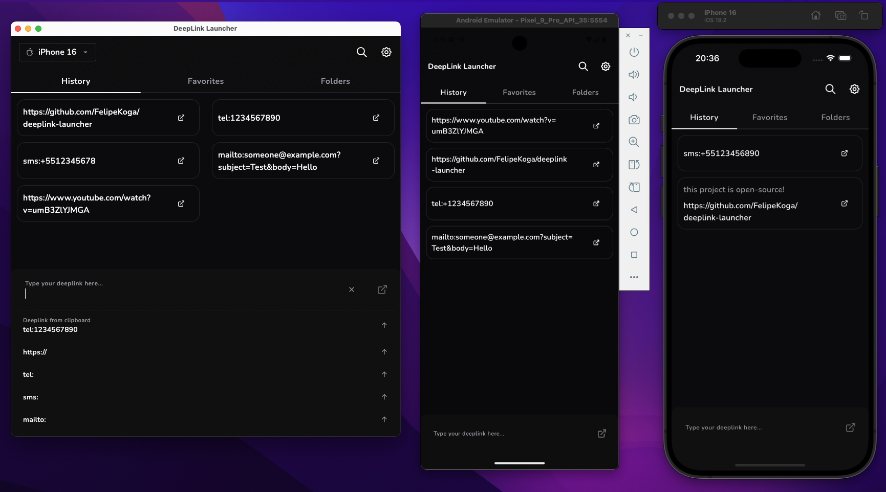

<p align="center">
  
</p>

<h1 align="center">DeepLink Launcher</h1>

<p align="center">
  DeepLink Launcher is a Compose Multiplatform app designed for executing and managing deeplinks. It offers developers and QA teams an intuitive interface for testing, organizing, tracking, and sharing deeplinks.
</p>

<p align="center">
  <a href="https://github.com/FelipeKoga/deeplink-launcher/stargazers">
    
  </a>
  <a href="https://github.com/FelipeKoga/deeplink-launcher/actions/workflows/release.yml">
    
  </a>
</p>

## Screenshot


## Features

- **Execute Deeplinks**: Instantly run deeplinks on Android, iOS, and Desktop.
- **Device Bridge**: Use ADB (Android) and Xcrun (iOS) from the Desktop app to execute deeplinks on connected devices.
- **Auto-suggestions**: Suggests deeplinks based on usage history and clipboard content.
- **Deeplink History**: View and re-use previously executed deeplinks.
- **Favorites**: Mark commonly used deeplinks as favorites.
- **Folders**: Organize deeplinks into folders.
- **Export/Import**: Export and import deeplinks in **JSON** or **TXT** formats.
- **Duplicate Deeplinks**: Easily clone existing deeplinks for quick reuse.
- **Theme Support**: Light and Dark themes available.
- **Search**: Quickly locate any deeplink.
- **In-App Purchase**: Support the project with a donation (Android only).

## Built With

| Technology | Description |
|------------|-------------|
| [**Compose Multiplatform**](https://github.com/JetBrains/compose-jb) | UI toolkit for building native UIs across platforms. |
| [**Koin**](https://insert-koin.io/) | Dependency injection for Kotlin. |
| [**SQLDelight**](https://cashapp.github.io/sqldelight/) | Multiplatform database with type-safe Kotlin APIs. |
| [**DataStore**](https://developer.android.com/jetpack/androidx/releases/datastore) | Coroutine-based key-value storage. |
| [**Material3**](https://m3.material.io/) | Google's cross-platform design system. |
| [**Kotlinx Immutable**](https://github.com/Kotlin/kotlinx.collections.immutable) | Immutable collections for Kotlin. |
| [**Kotlinx DateTime**](https://github.com/Kotlin/kotlinx-datetime) | Date and time utilities for Kotlin. |
| [**AboutLibraries**](https://github.com/mikepenz/AboutLibraries) | Open-source license viewer for Android. |
| [**Detekt**](https://github.com/detekt/detekt) | Static code analysis for Kotlin. |
| [**Ktlint**](https://github.com/pinterest/ktlint) | Kotlin linter for code formatting. |
| [**MPFilePicker**](https://github.com/Wavesonics/compose-multiplatform-file-picker) | File picker for Compose Multiplatform. |
| [**Material 3 Window Size Class**](https://github.com/chrisbanes/material3-windowsizeclass-multiplatform) | Cross-platform window size detection. |
| [**RevenueCat**](https://www.revenuecat.com/) | Subscription and in-app purchase management. |

## Getting Started

- **JDK**: 17
- **Android Studio**: **Ladybug (AI-243)** or newer
- **Xcode**: Optional, only needed to run the iOS app locally. We recommend using the latest **stable** version

*If you encounter issues running the app locally, feel free to open an issue or check the ]Kotlin Multiplatform setup guide](https://www.jetbrains.com/help/kotlin-multiplatform-dev/multiplatform-setup.html).*

After setting up your environment, run the following commands to set up local config files:

```bash
cp env.properties.example env.properties
cp keystore.properties.example keystore.properties
