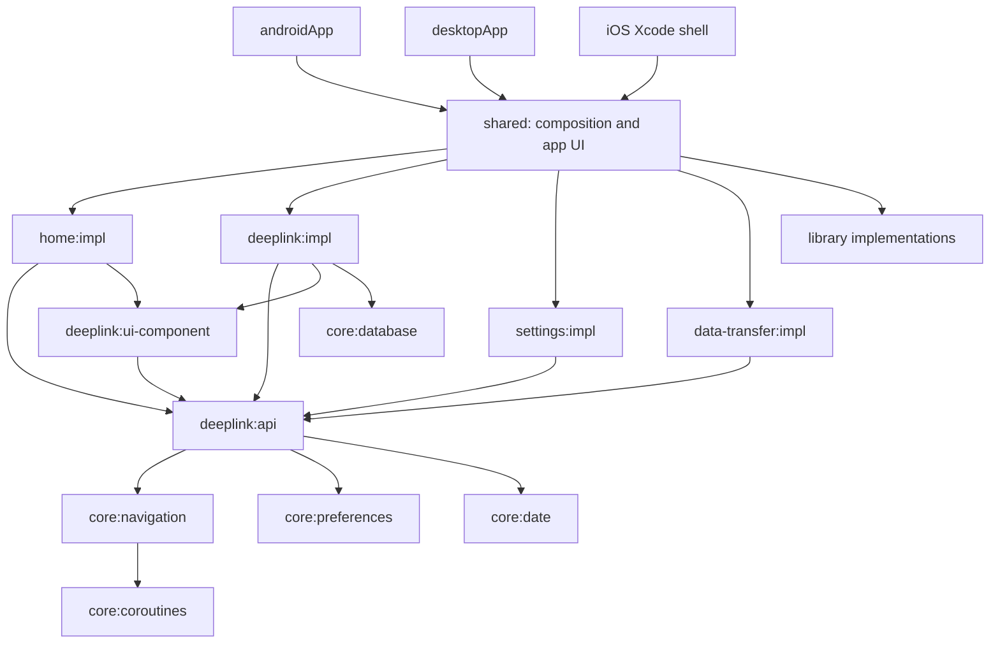
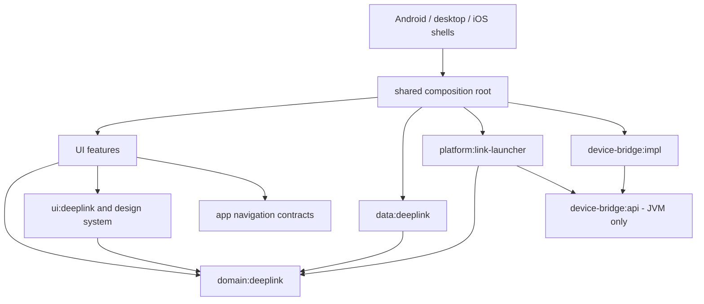

# DeepLink Launcher: architecture and modularization review

Date: 2026-09-19  
Baseline: commit `ce70ebe5`, plus the working tree present during review.  
Scope: Kotlin Multiplatform architecture, module ownership, dependency contracts, persistence, platform integrations, presentation state, build conventions, testing, and release confidence.

## 1. Recommendation

**Keep the modular monolith and feature-oriented UI. Evolve it toward a shared deeplink business capability, with selective API/implementation separation.** The current architecture is a reasonable foundation; a rewrite or a framework migration is not justified by the evidence.

The main weakness is not that there are too many or too few Gradle modules. It is that module boundaries do not consistently match responsibility boundaries:

- `feature:deeplink` is simultaneously the application's shared business capability, persistence implementation, platform integration, presentation model provider, and a collection of screens.
- `core:database` owns product-specific deeplink/folder tables, while the repositories and policies that govern those tables live elsewhere.
- Some API modules expose contracts nobody outside their implementation consumes. Others mix navigation, presentation, domain, and platform contracts.
- Compile-time separation exists, but validation, transactional integrity, threading, and lifecycle contracts remain weak.

**Fix data integrity and execution contracts before moving files.** Otherwise, modularization will relocate the same failure modes into more neatly named directories.

The preferred end state is:

1. A small, UI-independent deeplink domain containing models, ports, and shared business workflows.
2. A data module owning SQLDelight, schema, migrations, mapping, and atomic writes.
3. Platform adapters that report launch outcomes without owning history policy.
4. Cohesive UI features with internal presentation details.
5. Separate `api` modules only where there is a real consumer, substitution requirement, or measured build benefit.

This recommendation assumes the repository is maintained by a small team and its current Android, desktop, and iOS scope remains relevant. Team size and build-time pain were not provided. Larger independent feature teams could reasonably retain more feature API modules.

## 2. Evidence and limits

This was a source and build review, not an interactive device QA session. I inspected all module build files, convention plugins, CI workflows, composition/navigation infrastructure, public feature contracts, and the principal persistence, launch, import/export, purchase, and ViewModel paths. UI components and platform helpers were sampled around those paths. I consulted primary documentation where framework semantics affected recommendations.

| Check | Result |
|---|---|
| Included leaf modules in `settings.gradle.kts` | 30; excludes root, implicit grouping projects, and the included `build-logic` build |
| Application/library Kotlin source | 321 `.kt` files, 14,638 lines; excludes `androidDebug` previews, test source sets, generated/build files, and build logic |
| Baseline profile / benchmark Kotlin | 2 additional files, 144 lines |
| Declared `implementation(projects…)` / `api(projects…)` edges | 91, including platform-specific edges |
| Cycles in those declared edges | None found |
| Cross-feature `impl → impl` edges | None found |
| Unit test files found | 5, all in device bridge or desktop platform storage |
| Existing JVM suites | 15 tests passed, zero failures/errors/skips |
| SQL conflict behavior | Reproduced independently in an in-memory SQLite database using the repository schema and upsert SQL |

Executed successfully:

```sh
./gradlew :library:device-bridge:impl:test :core:platform:jvmTest --offline --console=plain
```

The first attempt was blocked from writing Gradle's user-cache lock; the authorized retry succeeded. The test run covers 4 device-bridge tests and 11 desktop storage tests. It does **not** establish correctness of the business flows below.

No full Android build, iOS framework build, desktop distribution build, device interaction, accessibility audit, or performance benchmark was performed. Performance findings describe work executed and likely scaling risks, not measured frame-time regressions. Dependency versions were inspected, but this is not a vulnerability or upgrade audit.

Pre-existing changes to `DLLTextField.kt`, the keystore working-tree state, and untracked `mobile-agent/` artifacts were left untouched. Only this review document was added. Source references below are relative to this document, with line anchors against the reviewed snapshot.

## 3. What is already working architecturally

**Feature isolation is real.** Home, settings, and data transfer consume deeplink contracts without depending on deeplink implementation. SQLDelight-generated records are translated to application models. This is a useful foundation for substitution and testing. [Module policy][module-guide], [deeplink repository][repository]

**The composition root is in the right place.** `shared` composes Koin modules, the app UI, and feature navigation; platform shells are small. The desktop-only bridge is wired in `jvmMain`. A composition root depending on implementations is expected and should not be treated as an architecture violation. [Initializer][initializer], [JVM composition][jvm-composition]

**KMP source sets are used productively.** Shared UI and application behavior coexist with Android/iOS/JVM integrations. Analytics and purchase have explicit no-op variants. Keep the common/platform split and the constructor-injected interfaces; changing DI frameworks would not address the findings here.

**Presentation has a useful unidirectional shape.** Several screens expose actions and immutable state through `StateFlow`, use lifecycle-aware collection, and pass callbacks to reusable components. Typed routes carry IDs instead of whole database objects. [Home state][home], [deeplink routes][routes]

**The design system and reusable deeplink widgets deserve boundaries.** The former contains product-wide visual tokens/components; the latter has actual consumers in home and deeplink screens. The widget module is a stronger example of justified extraction than the unused home route API. [Design-system guide][design-guide], [widget build][widget-build]

**Build conventions and a version catalog reduce duplication.** These mechanisms are worth retaining, with narrower responsibilities and stronger verification.

## 4. Current architecture: what the graph means

The diagram shows selected compile-time dependencies, not every edge. Arrows mean “depends on.”



### 4.1 The deeplink module is a shared capability disguised as a screen feature

`deeplink:api` has six direct module consumers. `deeplink:impl` contains 79 production Kotlin files and 5,361 lines; its API adds 33 files and 421 lines. Size alone is not a defect. The concern is that unrelated changes converge on the same boundary: database changes, launch behavior, handler-icon loading, details UI, folder editing, and suggestions.

The composition module loads one `deepLinkModule` that registers repositories, business operations, enrichment, platform adapters, ViewModels, and navigation together. A test or alternative host that wants only the repository/workflows must understand this aggregate registration. [Deeplink DI][deeplink-di]

Make the business capability independent of screens. Keep folders with deeplinks for now: they share queries, relationships, and atomic operations. Splitting folders into another domain merely because they have screens would introduce coordination overhead without evidence of independent ownership.

### 4.2 An `api` suffix does not guarantee a minimal contract

The guide prohibits presentation logic in API modules, but `deeplink:api` contains string truncation implementations, display-name fallback logic, UI models, and UI-enrichment interfaces. Those are valid pieces of code; their placement makes the contract broader than the stated policy. [Formatting][formatting], [details model][details-model], [module policy][module-guide]

Conversely:

- `home:api` contains a seven-line `HomeRouteEntryPoint` that is not referenced elsewhere. Actual registration and the app start destination use `HomeRoute.Home` from the implementation.
- Data-transfer's four use-case interfaces are consumed only by its own implementation in the reviewed source tree. Settings consumes its navigation route, not its import/export services.
- `EnrichDeepLinkForDetails` is public but is consumed only within deeplink implementation.
- `deeplink:api` declares `core:preferences` even though no Kotlin source in that API imports it.

These are opportunities to shrink contracts without changing product behavior. An interface may still be useful for a test double; that does not require a separate Gradle API artifact. [Home route API][home-api], [home graph][home-graph], [deeplink API build][api-build]

### 4.3 Domain consumers inherit conceptual UI dependencies

Repository contracts and business models live in the same API artifact as routes. That artifact depends on `core:navigation`, which itself brings navigation runtime, DI, and coroutine infrastructure. JVM `DeepLinkTarget` also exposes `DeviceBridge.Platform` directly.

The issue is not that these references create a cycle—they do not. It is that a consumer concerned only with storage or business behavior shares a contract boundary with presentation and integration details. Keep domain contracts independent of navigation and presentation. Put UI enrichment/model types in UI-owned code and platform SDK/process details behind ports. [Navigation build][navigation-build], [target model][target-model]

### 4.4 Visibility and build dependencies only partly enforce the policy

The guide says ViewModels/screens are internal, but `HomeViewModel`, `ExportViewModel`, and multiple settings ViewModels are public by default. Deeplink implementation applies `explicitApi()`; enforcement is not uniform elsewhere. API libraries also apply it inconsistently.

Mark implementation declarations `internal`, exposing only deliberate entry points and module factories. Then validate module edges in build logic. `explicitApi()` is useful for intentional public declarations, but it is not an architecture dependency checker. [Home ViewModel][home], [export ViewModel][export-vm], [deeplink implementation build][impl-build]

Also audit `api(...)` versus `implementation(...)` at actual exported type boundaries. For example, public repository signatures expose `Flow`, yet coroutines is an implementation dependency. Current consumers often add the same libraries themselves, masking contract dependency requirements. This is a dependency-hygiene concern, not a demonstrated compilation failure. Gradle distinguishes dependencies required by a library's public API from implementation details. [Gradle guidance](https://docs.gradle.org/current/userguide/java_library_plugin.html)

### 4.5 Small modules are not automatically bad

`core:date` has 80 lines, `core:coroutines` 47, `core:ui-event` 52, and `core:ui` 67. A small capability with several consumers can justify a module. However, the blanket convention creates Android, JVM, and three iOS targets for nearly every KMP module, and the Compose convention adds a broad UI/lifecycle dependency set.

Evaluate each split by independent ownership, dependency isolation, reuse, testability, and measured build behavior. Do not merge all core modules into a catch-all `common`, and do not add an API/implementation pair to each helper. The unused home API is a concrete simplification candidate; the others require a benefit/cost assessment. [KMP convention][kmp-convention], [Compose convention][compose-convention]

## 5. Prioritized correctness and operational findings

Priority describes remediation order: **P1** is material data-integrity or broken-workflow risk; **P2** is reliability, maintainability, or performance risk. “Source-confirmed” means the path is visible in code; it does not imply device reproduction.

### F1 — P1: editing a URL can silently delete another saved link

**Evidence:** `updateLink()` persists before validating. `DeepLink.sq` defines `link UNIQUE` and writes with `INSERT OR REPLACE`. Editing record A to record B's URL therefore resolves the conflict by removing B, rather than rejecting the edit. [Edit path, lines 218–226][details-edit], [SQL, lines 3–27][deeplink-sql]

**Verification:** reproduced with the actual schema and upsert statement, using Python's in-memory SQLite. Before: `(A, demo://one)` and `(B, demo://two)`. After writing `(A, demo://two)`: only A remains. This matches SQLite's documented replacement semantics. [SQLite conflict resolution](https://www.sqlite.org/lang_conflict.html)

**Recommendation:** use an ID-scoped update and explicit duplicate detection/result semantics, with the unique constraint as the final race-safe guard. Validate before mutation. Do not make arbitrary “upsert entire entity” the default command for every edit.

**Acceptance:** editing to an existing URL leaves both records unchanged and displays a duplicate error; invalid URLs never become persisted valid-state records; concurrent edits preserve unrelated fields.

### F2 — P1: folder replacement can destroy identity and detach relationships

`folder.name` is unique and `upsertFolder` also uses `INSERT OR REPLACE`. Folder editing writes through that operation. Additionally, every deeplink upsert rewrites its embedded folder, even for an unrelated favorite or timestamp change. [Folder SQL][folder-sql], [folder editing][folder-vm], [repository lines 59–75][repository-write]

Two distinct problems follow. Renaming a folder to an existing name can replace another folder's identity. A stale `DeepLink.folder` snapshot can overwrite a newer folder name or description when the link is updated. The exact relationship outcome of a uniqueness conflict depends on foreign-key enforcement; I reproduced an orphaned reference with enforcement disabled, but did not verify enforcement on every application driver.

**Recommendation:** make link writes reference a folder ID without recreating/updating the folder. Provide separate folder commands with explicit uniqueness handling. Verify foreign-key behavior per driver and protect it with integration tests.

**Acceptance:** renaming to a conflicting name never deletes another folder; changing favorite/launch time cannot rename or resurrect a folder; deletion and reassignment preserve referential integrity.

### F3 — P1: failed imports can still modify the database

JSON import writes folders before converting all deeplinks and parsing their dates. It then writes links individually. A malformed `createdAt` or later database failure returns `Unknown` after earlier changes have committed. Individual link transactions do not make the whole import atomic. [Import, lines 54–125][import], [payload conversion][payload]

**Recommendation:** parse and validate the entire payload first, establish explicit ID/URL/name conflict semantics, then apply an import plan in one database-owned transaction. Expose a purpose-specific atomic operation, rather than leaking SQLDelight transactions into the feature. Rethrow cancellation instead of converting it to a generic import error. Normalize TXT line endings, blank lines, and duplicate entries before validation.

**Acceptance:** a payload with a valid folder and malformed link date makes zero changes; a failure on the final write rolls back the whole import; repeated import has a documented deterministic result; imported IDs cannot silently overwrite unrelated local records.

### F4 — P1: an offerings error leaves purchase suspended indefinitely

`purchase()` uses `suspendCoroutine`; the initial `getOfferings(onError = {})` never resumes the continuation. A missing package is force-unwrapped. [RevenueCat adapter, lines 47–65][purchase]

**Recommendation:** adapt callbacks with cancellation-aware suspension, complete every error branch exactly once, handle a missing package explicitly, and prevent duplicate in-flight purchases. Keep SDK behavior inside the adapter and expose typed outcomes to the feature.

**Acceptance:** offerings failure, missing package, purchase cancellation, successful purchase, and ViewModel cancellation all terminate predictably. A callback arriving after cancellation cannot trigger obsolete UI work.

### F5 — P1 for iOS readiness: launch capability checks and success semantics are incomplete

The iOS launcher gates opening on `canOpenURL`, but the checked-in plist has no `LSApplicationQueriesSchemes` entry. This is a poor fit for an app intended to launch arbitrary custom schemes: Apple documents restrictions on querying undeclared schemes. It also ignores the `openURL` completion boolean and returns success immediately. [iOS launcher][launch-ios], [plist][ios-plist], [Apple documentation](https://developer.apple.com/documentation/uikit/uiapplication/canopenurl(_:))

**Recommendation:** distinguish parsing validity, queryable capability, and actual open outcome. Where appropriate, attempt opening and use the completion result rather than using a restricted preflight query as a universal gate. Keep UIKit calls on the required thread. Verify behavior on physical devices with installed/uninstalled custom-scheme handlers.

This is source-level readiness evidence, not a claim that the whole iOS app was tested or that all schemes fail.

### F6 — P2: repository and file contracts are not safe to call from the UI thread

Reactive SQL queries use `mapToList(Dispatchers.IO)`, which is good. Synchronous reads/writes still execute directly. `HomeViewModel` calls them from `viewModelScope`; export computes previews in its constructor; import reads/copies files and writes records from a main-scope coroutine; delete-data calls repositories directly. `suspend` alone does not move execution off the calling dispatcher. [Repositories][repository], [home][home], [export ViewModel][export-vm], [import ViewModel][import-vm], [delete-data][delete-data]

**Recommendation:** make blocking repository/file operations suspend and main-safe internally, using injected dispatchers. Keep a transaction on its intended execution context; do not scatter independent context switches through transaction bodies. Keep platform UI operations on Main, and move file/process/database work to appropriate dispatchers. This follows the execution responsibility described in the official data-layer guidance. [Android data layer](https://developer.android.com/topic/architecture/data-layer)

**Acceptance:** importing/exporting a large fixture and editing/favoriting records performs no disk IO on the UI thread; dispatcher-controlled tests can exercise these paths deterministically.

### F7 — P2: launch/history policy is duplicated across platforms and screens

All three platform launchers update `lastLaunchedAt` before opening, including failed attempts. Creation-after-launch is separately implemented in home and the folder linking flow. Settings reuses the same launcher for GitHub/Play Store, so on desktop an external help link follows the selected remote device target. [Android launcher][launch-android], [JVM launcher][launch-jvm], [iOS launcher][launch-ios], [home][home], [folder linking][link-vm], [settings links][settings-vm]

**Recommendation:** separate `OpenLink` platform execution from a shared `LaunchAndRecord` policy. Explicitly decide whether history means attempts or successful opens; name and store those separately if both matter. Give local help/browser links a distinct destination policy. Return enough outcome information for analytics and the UI without exposing platform internals.

**Acceptance:** Android, iOS, and desktop apply the same history rule; failed opens do not masquerade as successful launches; opening help behaves independently of the selected test device unless that behavior is intentional.

### F8 — P2: file references have incompatible meanings across platforms

Common APIs pass `String` values called paths, but Android export returns a content URI, iOS save returns an absolute URL string, and desktop uses filesystem paths. iOS sharing then feeds the returned URL string into `fileURLWithPath`. Android import force-unwraps path resolution before entering the import use case's error handling. [iOS save][save-ios], [iOS share][share-ios], [Android path resolution][path-android], [import ViewModel][import-vm]

There is also a concrete permission gap: Android permission requesting is a TODO below API 30, while export returns early when permission is not granted. Android 29's MediaStore branch and permission gate should be reconciled. [Permission implementation][storage-permission], [Android save][save-android]

**Recommendation:** use a document/file handle with explicit read/write/share operations, plus metadata such as display name and content type. Preserve native URI semantics. Make permission/picker presentation a UI-host responsibility and return cancellation/failure explicitly. If a temporary copy is necessary, generate a safe cache filename rather than using a provider display name as an internal destination.

**Acceptance:** test Android document providers without usable display names, cloud-backed files, API 26–29 export, and the iOS save/share round trip. No failed resolver should crash a ViewModel or falsely report export success.

### F9 — P2: preview and export implement different data snapshots

JSON preview reads all folders, including empty ones. Actual export derives folders only from exported links and returns `Empty` if there are no links. Two DTO structures independently describe the same apparent export format. [Preview][json-preview], [export][export]

**Recommendation:** create one snapshot/codec path used by preview and actual output. Decide whether JSON represents a backup or only selected links; if it is a backup, preserve empty folders and deliberately address omitted fields such as launch history. Add a format version when evolving the interchange contract, with backward-compatibility fixtures.

**Acceptance:** preview and exported content describe the same records; a folder-only library is exportable if backup semantics are intended; export/import round trips preserve every documented field.

### F10 — P2: process lifetime and device tracking escape the bridge boundary

`DeviceBridge.launch` returns `java.lang.Process`; the feature interprets exit codes and reads stderr. The bridge waits before draining output, has no timeout, and does not reliably destroy processes on cancellation. A sufficiently verbose subprocess can block on full pipes while the parent waits. `adb track-devices` has no cleanup block. Its state is updated by adding/replacing individual devices, with no removal path for a disconnected device absent from a later snapshot. [Bridge API][bridge-api], [ADB implementation][adb], [xcrun implementation][xcrun], [JVM launcher][launch-jvm]

**Recommendation:** retain the bridge API/implementation split, but return a typed completed result. Keep process creation, concurrent output draining, timeout, cancellation, and termination inside the implementation. Parse complete device snapshots and reconcile removals. Reset or reject a selected target when it disappears. Inject a command runner for deterministic tests.

**Acceptance:** attach/detach updates the list; cancelled tracking leaves no child process; a hanging command times out; large stderr cannot deadlock; a stale target yields a clear result.

### F11 — P2: mutable DI scope does not match state ownership

`CoroutineDebouncer` is a singleton keyed only by strings such as `name`, `description`, and `link`. Two live details ViewModels can cancel each other's edits. Completed jobs remain in its map. Desktop dropdown managers receive newly created scopes with no exposed close operation; preferences and target tracking also create their own scopes. [Coroutine DI][coroutine-di], [debouncer][debouncer], [details edits][details-edit], [desktop manager DI][dropdown-di], [target manager][target-manager]

**Recommendation:** keep debounce jobs in the owning ViewModel or use a factory-scoped helper. Inject an explicitly owned application scope for app-lifetime state and screen scopes for screen-lifetime work. Scope cancellation and subprocess cleanup must cooperate; replacing one without the other is insufficient.

**Acceptance:** editing two records does not cancel unrelated changes; closing a scope stops owned work; pending edits have a defined flush/cancel policy.

### F12 — P2: details state conflates loading, missing records, and usable data

Details uses `DeepLink.empty` as initial state and filters out null repository emissions. A deleted/missing ID is therefore not modeled as a distinct state. Editing writes whole entity snapshots, allowing stale values from one operation to overwrite newer unrelated fields. Debounced writes may disappear when the ViewModel is cleared. [Details state][details-state], [details edits][details-edit]

**Recommendation:** model `Loading`, `NotFound`, `Content`, and recoverable failure explicitly. Own draft fields in presentation state, validate them, then commit an intentional operation. Use field-specific commands where edits should be independent. Store only the transient input that needs restoration in `SavedStateHandle`; routes already use it correctly for IDs.

**Acceptance:** missing IDs cannot expose enabled actions for an empty entity; editing preserves unrelated concurrent updates; back navigation has an intentional pending-edit policy; important drafts survive recreation where required.

### F13 — P2: CI does not exercise the tests that currently exist

The PR workflow invokes `testDebugUnitTest` and `ktlint`. The discovered tests live in a JVM-only bridge module (`test`) and a KMP `jvmTest` source set, so those Android unit-test tasks do not select these suites. There are no feature/business unit tests. No iOS build gate is present. The convention's `check.setDependsOn(...)` replaces existing dependencies rather than adding analysis tasks; it can discard lifecycle checks wired before it executes. [PR workflow][pr-ci], [analysis convention][analysis-convention]

**Recommendation:** add explicit JVM test tasks, Android tests/assembly, Detekt, and an iOS simulator framework compile/link job on macOS. Use additive `dependsOn`. Add architecture validation as a separate fast check. Verify the resulting task graph rather than assuming a green `check` represents every target.

Avoid requiring production Firebase or signing credentials just to validate local/domain tests. A clean checkout and fork PR should have a documented debug/test configuration.

**Acceptance:** intentionally failing a JVM test fails the PR; feature common tests are selected by CI; Android and iOS compilation errors fail before release; forbidden dependency edges fail automatically.

### F14 — P2: screen analytics uses deserialization as a route-type check

The central resolver tries `toRoute<HomeRoute.Home>()` first, then other route types inside `runCatching`. Argument reconstruction is not a reliable destination identity test; a no-argument object can deserialize without establishing that it is the current destination. This creates a strong risk that unrelated screens are labeled `home`. The current upstream implementation reconstructs the requested serializer from arguments without a route-identity check. This finding is source-based and was not runtime-reproduced against the app's resolved binary. [Resolver][analytics-resolver], [upstream implementation](https://raw.githubusercontent.com/JetBrains/compose-multiplatform-core/jb-main/navigation/navigation-common/src/commonMain/kotlin/androidx/navigation/NavBackStackEntry.kt)

**Recommendation:** match destination identity with `hasRoute<T>()` before reconstruction, or register screen metadata alongside each feature graph. The latter also removes the root's need to import every implementation's internal screen type.

**Acceptance:** navigate through every destination and assert its distinct screen name. Keep raw URLs/query tokens out of events. Also define whether `SearchUsed` means each keystroke or a search session, and report imported counts from the import result rather than total database size. [Home search][home], [import analytics][import-vm]

## 6. Better modularization: compare the options

| Strategy | Benefits here | Costs here | Assessment |
|---|---|---|---|
| Keep the current universal feature `api`/`impl` convention | Existing isolation, consistent navigation contracts, low migration cost | Broad deeplink contract, unused exports, mandatory tiny artifacts, weak business ownership | Viable if contracts and data behavior are tightened; not my preferred default |
| Feature UI + shared business capability + selective API splits | Clear policy/data/platform ownership; business tests without UI; fewer accidental public contracts | Requires extracting deeplink responsibilities and changing DI/navigation seams | **Recommended incremental direction** |
| `data`/`domain`/`presentation` Gradle modules for every feature | Strong layer separation and explicit dependencies | Multiplies small modules, repeats interfaces, creates cross-feature coordination | Excessive for the current product; use packages inside cohesive features |
| A few global layer modules (`data`, `domain`, `ui`) | Simple build graph and fewer artifacts | Broad change/visibility scope; mixes unrelated UI features and integrations | Reasonable for a prototype, weaker fit than current feature isolation |
| Plugin/dynamic-feature architecture or independent published packages | Independent delivery or external consumers | Versioning, compatibility and composition complexity without a demonstrated need | Not justified by this repository |

Official guidance likewise treats modularization as a cohesion/coupling decision rather than a universal module template. The specific module layout proposed here is a judgment based on this repository's dependencies and workflows. [Android modularization patterns](https://developer.android.com/topic/modularization/patterns), [modularization tradeoffs](https://developer.android.com/topic/modularization)

### 6.1 Proposed ownership map

Names are illustrative. Do not rename everything in one change.

| Proposed boundary | Owns | Allowed dependencies |
|---|---|---|
| `:domain:deeplink` | `DeepLink`/`Folder`, repository and launcher ports, shared validation/launch/duplicate/link policies, typed outcomes | Kotlin, coroutines/time as needed; no Compose, navigation, Koin, SQLDelight, or vendor SDK |
| `:data:deeplink` | SQL schema, migrations, drivers, mapping, repositories, atomic import/delete/edit operations | Domain and small platform storage helpers |
| `:platform:link-launcher` | Android intents/handler inspection, UIKit URL opening, JVM browser/device execution adapters | Domain; device-bridge API on JVM |
| `:feature:home`, `:feature:deeplink`, `:feature:settings`, `:feature:data-transfer` | Screens, ViewModels, internal screen operations, presentation state, graph registration | Domain, UI infrastructure, necessary library APIs; not another feature implementation or SQL |
| `:ui:deeplink` (evolved widget module) | Shared cards/input widgets, presentation models/formatting, shared UI enrichment if needed | Domain + design system; no feature implementation or persistence |
| `:core:navigation` | App route vocabulary and navigation infrastructure for the chosen navigation approach | UI/runtime infrastructure only; domain never depends on it |
| Existing analytics/purchase/device-bridge APIs + implementations | Integration contracts and vendor/process adapters | Contracts remain independent of features; impl depends on its API |
| Existing focused core modules | Design system, document IO, preferences, time, coroutine support | No feature dependencies; avoid a generic dependency aggregator |
| `:shared` | App composition, DI bindings, navigation composition, initialization | Features and concrete adapters |

Start by absorbing product-specific `core:database` into `data:deeplink`, or restrict it to that sole data consumer while extracting. There is no current need for an app-wide public database API. `core:preferences` can remain one module with its implementation internal; splitting it into two is optional, not required.

The domain can hold concrete reusable workflow classes. Create an interface when consumers need a port/substitute, not automatically for every class. Wire these classes at the composition root. Presentation enrichment may need a shared helper, but that helper belongs to a UI boundary and must not pull UI models back into the domain.



This is dependency inversion around the business capability. At runtime the root injects data/platform implementations into shared policies; features consume those policies and read models. It is still one application, with no service bus, remote services, or plugin framework required.

### 6.2 Navigation: choose one coherent approach

For the current size, prefer app-owned route composition and feature entry points/callbacks. Features register their destinations and request navigation through the small app navigation vocabulary; the root decides concrete destinations. Existing `core:navigation` can host this without immediately creating another API/runtime pair. The tradeoff is centralized route ownership, acceptable for a small team.

If feature teams need independent contracts, retaining feature-specific route API modules is reasonable. Then use those exact routes for actual registration, eliminate dead duplicates such as `HomeRouteEntryPoint`, and keep business contracts separate from routes.

Avoid a halfway state where each feature has an API artifact but the root imports implementation route types anyway. A root may legally depend on implementation exports, but that choice must be deliberate rather than undermining the purpose of a second contract.

### 6.3 Do not require use cases for every repository call

The current guide proposes enforcing ViewModels to depend only on use cases. I would change that proposal. A ViewModel reading a repository flow is not inherently a problem. The official Android domain layer is optional and especially useful for reused or complex behavior. [Domain-layer guidance](https://developer.android.com/topic/architecture/domain-layer)

Extract operations where this repository demonstrates a real invariant or repeated workflow:

- Launch a link and record its outcome consistently.
- Edit a URL with validity and uniqueness guarantees.
- Link/move a record to a folder without rewriting folder contents.
- Apply an import plan atomically.
- Delete all library data atomically.

A `GetThemeUseCase` that only forwards `preferencesStream` adds little. More valuable constraints are “features cannot access SQL,” “writes preserve invariants,” and “blocking operations are main-safe.”

### 6.4 When a separate module or interface earns its cost

Use a separate Gradle module when it provides meaningful compile-time isolation, independent ownership, multiple real consumers, dependency/platform isolation, or measured build/test improvement. Use packages for organization alone.

Keep an API artifact when consumers need to avoid a substantial implementation classpath, implementations vary independently, or the contract is shared/published. Analytics, purchase, and device bridge have credible reasons; the current unused home entry route does not.

Enforce these rules with a small project-dependency validation task over **all source-set configurations**, including platform-specific dependencies. Add checks that core/domain cannot depend on features, domain cannot depend on UI/vendor implementation, and features cannot depend on another feature's implementation. Prefer this to a large custom architecture framework.

## 7. Additional engineering observations

| Area | Observation and action |
|---|---|
| Search and enrichment | Suggestions load the entire repository on input changes, build a full signature, and sort entries. Search recreates query flows, and home enriches both the result list and all folder preview candidates before taking the visible preview subset. Cache/index from repository emissions; bound preview work before enrichment. Benchmark realistic history sizes before introducing paging or complex caches. [Suggestions][suggestions], [home][home] |
| Handler icons | Android resolves and PNG-encodes icons; Compose decodes bytes during composition with `remember`. Bounded LRU caches help, but there is no visible package-change invalidation. A 128-entry count is not a byte budget. Measure memory/CPU, reuse decoded images where justified, and define invalidation. [Icon adapter][icon-adapter], [icon component][icon-component] |
| Accessibility | Favorite and launch are icon-only buttons with `contentDescription = null`; their wrappers do not supply labels. Add action labels and favorite state semantics. Decorative icons may remain unlabeled. Validate TalkBack/VoiceOver, keyboard focus, and large text on devices. [Card actions][card-actions] |
| Localization and errors | UI messages and relative-date text are hardcoded across ViewModels/utilities despite a resources module. Prefer typed failure/state values translated at the UI boundary. Distinguish “invalid URL,” “handler missing,” “permission denied,” and “IO failure”; do not label every launch failure as a missing app. [Home errors][home], [import result handling][import-vm] |
| Time model | Persistent model fields use `LocalDateTime` while the database adapter converts through the current timezone. Cross-device JSON lacks an offset and loses subsecond precision. Consider `Instant` for event history and local formatting only in presentation. Treat this as an explicit schema/interchange migration, not a mechanical type rename. [Date adapter][date-adapter], [payload][payload] |
| Initialization | Desktop calls `AppInitializer.init()` inside the composable `application` body. Move one-time startup outside recomposable content, or explicitly guard it. The global `startKoin` approach also makes isolated host/DI tests harder without shutdown/reset ownership. [Desktop entry][desktop-entry], [initializer][initializer] |
| Diagnostics | Recomposition logging is configured unconditionally in the initializer. Make developer instrumentation an explicit debug concern; verify what its plugin includes in release before asserting a release overhead. [Initializer][initializer] |
| DI verification | No graph verification tests were found. Data-transfer registers `ImportDeepLinksImpl` twice. Remove duplicate registrations and test platform graph construction plus parameterized ViewModels/SavedStateHandle. [Transfer DI][transfer-di] |
| Build conventions | Keep separate base KMP, Compose UI, and test/analysis responsibilities. Do not turn every module into a UI module by default. Give the root an explicit name: the test run warned that checkout-directory changes affect generated accessors/caching. Measure clean/incremental builds before claiming smaller modules improve speed. [Settings][settings-build], [conventions][compose-convention] |
| Release configuration | Android uses catalog version `2.0.0`, desktop hardcodes `1.12.0`, and iOS plist says `1.0`; decide whether these represent intentional independent version lines. Release creates a tag before validation/build and has no test gate. Promote a tested revision and reconcile artifacts/version metadata before tagging. [Catalog][catalog], [desktop build][desktop-build], [release workflow][release-ci] |
| Secret-independent builds | Android signing configuration and purchase BuildKonfig read environment/configuration values during project configuration. CI injects secrets into PR validation. Review the clean-checkout/fork behavior and provide non-production debug defaults without weakening release signing. No secret contents were inspected. [Android build][android-build], [purchase build][purchase-build] |
| Data handling | Deeplink URLs can contain credentials. The analytics facade is a good place to enforce content-free event parameters. Review intentional local retention, export, backup, and log behavior; the Android manifest enables backup. This review did not establish a leak or assess backup policy completeness. [Analytics policy][analytics-guide], [manifest][android-manifest] |

## 8. Incremental migration plan

Do not combine the correctness fixes, module moves, dependency upgrades, and UI redesign into one PR. Keep each step independently reviewable and retain the existing schema/file compatibility unless a migration explicitly changes it.

| Phase | Work | Completion evidence |
|---|---|---|
| 1. Protect data and broken workflows | Fix conflict-safe link/folder commands, import rollback, purchase completion, and file/launch errors | Regression tests for F1–F5 and key file cases; no silent data replacement |
| 2. Establish execution and lifecycle contracts | Main-safe data/file operations; owned debounce/scope lifetimes; cancellable process adapter | Dispatcher tests, cancellation tests, timeout/pipe tests, no cross-screen edit cancellation |
| 3. Make validation meaningful | Run existing JVM suites in PRs; add common business tests, SQL integration tests, Koin/navigation verification, Android and iOS build gates | Deliberately introduced failures in each category fail CI |
| 4. Extract the shared capability | Move domain models/ports/policies out of feature API; move persistence behind data ownership; separate platform execution from history | Business tests run without Compose; SQL imports appear only in data; equivalent behavior through old and new callers |
| 5. Reduce accidental contracts | Internalize transfer-only operations and details enrichment; remove unused home API; make implementation visibility intentional | Export/consumer inventory, no cross-feature impl edges, working route registration |
| 6. Tune from evidence | Evaluate tiny core modules, plugin dependencies, icon/search cost, and build speed | Recorded before/after incremental build tasks and runtime measurements; retain only improvements with useful benefit |

For extraction, temporary forwarding adapters/type aliases can keep callers compiling while ownership moves. Remove them after consumers migrate. Preserve database name/location and import formats during structural changes. Do not couple module relocation to a storage migration. A rollback of the structural change should not require restoring user data.

### Test portfolio that would change confidence

| Boundary | High-value tests |
|---|---|
| Domain | Launch success/failure/history semantics; duplicate URL; missing record; moving folders; deterministic clock/ID behavior |
| SQL/data | Uniqueness conflicts, atomic import rollback, folder deletion/linking, concurrent field edits, migration from pre-`targetPackage` schema |
| Interchange | Versioned JSON fixtures, folder-only export, malformed dates, duplicate IDs/URLs/names, CRLF/trailing newline TXT, export/import round trip |
| ViewModel | Loading/not-found/error state, cancellation, pending edit policy, separate ViewModels sharing no debounce state, restored draft input |
| Platform | Android content URI and permissions, installed/uninstalled handlers, iOS completion result, desktop detached devices and process cleanup |
| Composition | Koin bindings per target, all route registrations, analytics identity for every route, no unnecessary production secrets |
| UI/performance | Accessible button names, a few representative semantic/screenshot checks, startup and large-history interactions; keep baseline profiles as performance support, not business correctness tests |

## 9. Decision to record

Adopt an ADR with this decision: **“Organize UI by feature and shared business behavior by capability. Use API/implementation Gradle separation selectively. Keep data integrity, execution context, and platform lifecycle responsibilities inside the boundary that can enforce them.”**

The highest-return next change is the conflict-safe write/import test and fix set. The highest-return structural change is separating the shared deeplink business capability from its screens. Removing a few tiny modules is secondary. The architecture succeeds when a screen change cannot alter data invariants, a platform adapter cannot redefine business policy, and those guarantees are executable in CI.

## Appendix: isolated data-loss reproduction

This reproduces the relevant schema constraints and the same conflict strategy without touching application data. The review also ran the upsert extracted directly from `DeepLink.sq` with all columns.

```python
import sqlite3

db = sqlite3.connect(":memory:")
db.execute("CREATE TABLE deeplink(id TEXT PRIMARY KEY, link TEXT UNIQUE NOT NULL)")
db.executemany("INSERT INTO deeplink VALUES (?, ?)", [
    ("A", "demo://one"), ("B", "demo://two"),
])
db.execute("INSERT OR REPLACE INTO deeplink VALUES (?, ?)", ("A", "demo://two"))
assert db.execute("SELECT id, link FROM deeplink").fetchall() == [("A", "demo://two")]
# Record B has been removed; this is not a conflict-safe edit.
```

[adb]: ../../library/device-bridge/impl/src/main/kotlin/dev/koga/deeplinklauncher/devicebridge/impl/adb/Adb.kt#L26
[analysis-convention]: ../../build-logic/src/main/kotlin/dev.koga.deeplinklauncher.code-analysis.gradle.kts
[analytics-guide]: ../../docs/ANALYTICS.md
[analytics-resolver]: ../../shared/src/commonMain/kotlin/dev/koga/deeplinklauncher/shared/analytics/AnalyticsScreenTracker.kt#L11
[android-build]: ../../androidApp/build.gradle.kts
[android-manifest]: ../../androidApp/src/main/AndroidManifest.xml
[api-build]: ../../feature/deeplink/api/build.gradle.kts
[bridge-api]: ../../library/device-bridge/api/src/main/kotlin/dev/koga/deeplinklauncher/devicebridge/api/DeviceBridge.kt#L5
[card-actions]: ../../feature/deeplink/ui-component/src/commonMain/kotlin/dev/koga/deeplinklauncher/deeplink/uicomponent/DeepLinkCard.kt#L159
[catalog]: ../../gradle/libs.versions.toml
[compose-convention]: ../../build-logic/src/main/kotlin/dev.koga.deeplinklauncher.compose-multiplatform.gradle.kts
[coroutine-di]: ../../core/coroutines/src/commonMain/kotlin/dev/koga/deeplinklauncher/coroutines/di/Module.kt#L8
[date-adapter]: ../../core/database/src/commonMain/kotlin/dev/koga/deeplinklauncher/database/converter/ColumnAdapters.kt#L10
[debouncer]: ../../core/coroutines/src/commonMain/kotlin/dev/koga/deeplinklauncher/coroutines/CoroutineDebouncer.kt#L8
[deeplink-di]: ../../feature/deeplink/impl/src/commonMain/kotlin/dev/koga/deeplinklauncher/deeplink/impl/di/Module.kt#L32
[deeplink-sql]: ../../core/database/src/commonMain/sqldelight/dev/koga/deeplinklauncher/database/DeepLink.sq
[delete-data]: ../../feature/settings/impl/src/commonMain/kotlin/dev/koga/deeplinklauncher/settings/impl/ui/deletedata/DeleteDataViewModel.kt#L22
[design-guide]: ../../docs/DESIGN_SYSTEM.md
[desktop-build]: ../../desktopApp/build.gradle.kts
[desktop-entry]: ../../desktopApp/src/jvmMain/kotlin/Main.kt#L9
[details-edit]: ../../feature/deeplink/impl/src/commonMain/kotlin/dev/koga/deeplinklauncher/deeplink/impl/ui/deeplinkdetails/DeepLinkDetailsViewModel.kt#L218
[details-model]: ../../feature/deeplink/api/src/commonMain/kotlin/dev/koga/deeplinklauncher/deeplink/api/ui/model/DeepLinkDetailsModel.kt#L8
[details-state]: ../../feature/deeplink/impl/src/commonMain/kotlin/dev/koga/deeplinklauncher/deeplink/impl/ui/deeplinkdetails/DeepLinkDetailsViewModel.kt#L76
[dropdown-di]: ../../feature/home/impl/src/jvmMain/kotlin/dev/koga/deeplinklauncher/home/impl/di/Module.jvm.kt#L10
[export]: ../../feature/data-transfer/impl/src/commonMain/kotlin/dev/koga/deeplinklauncher/datatransfer/impl/domain/usecase/ExportDeepLinksImpl.kt#L20
[export-vm]: ../../feature/data-transfer/impl/src/commonMain/kotlin/dev/koga/deeplinklauncher/datatransfer/impl/ui/screen/export/ExportViewModel.kt#L17
[folder-sql]: ../../core/database/src/commonMain/sqldelight/dev/koga/deeplinklauncher/database/Folder.sq#L1
[folder-vm]: ../../feature/deeplink/impl/src/commonMain/kotlin/dev/koga/deeplinklauncher/deeplink/impl/ui/folderdetails/FolderDetailsViewModel.kt#L100
[formatting]: ../../feature/deeplink/api/src/commonMain/kotlin/dev/koga/deeplinklauncher/deeplink/api/ui/formatting/DeepLinkFormatting.kt#L5
[home]: ../../feature/home/impl/src/commonMain/kotlin/dev/koga/deeplinklauncher/home/impl/ui/HomeViewModel.kt#L49
[home-api]: ../../feature/home/api/src/commonMain/kotlin/dev/koga/deeplinklauncher/home/api/ui/navigation/HomeRouteEntryPoint.kt#L7
[home-graph]: ../../feature/home/impl/src/commonMain/kotlin/dev/koga/deeplinklauncher/home/impl/ui/navigation/HomeNavigationGraph.kt#L17
[icon-adapter]: ../../feature/deeplink/impl/src/androidMain/kotlin/dev/koga/deeplinklauncher/deeplink/impl/domain/usecase/GetDeepLinkHandlerIconImpl.android.kt#L10
[icon-component]: ../../feature/deeplink/ui-component/src/commonMain/kotlin/dev/koga/deeplinklauncher/deeplink/uicomponent/DeepLinkHandlerIcon.kt#L19
[impl-build]: ../../feature/deeplink/impl/build.gradle.kts
[import]: ../../feature/data-transfer/impl/src/commonMain/kotlin/dev/koga/deeplinklauncher/datatransfer/impl/domain/usecase/ImportDeepLinksImpl.kt#L54
[import-vm]: ../../feature/data-transfer/impl/src/commonMain/kotlin/dev/koga/deeplinklauncher/datatransfer/impl/ui/screen/import/ImportViewModel.kt#L28
[initializer]: ../../shared/src/commonMain/kotlin/dev/koga/deeplinklauncher/shared/AppInitializer.kt#L26
[ios-plist]: ../../iosApp/deeplinklauncher/Info.plist
[json-preview]: ../../feature/data-transfer/impl/src/commonMain/kotlin/dev/koga/deeplinklauncher/datatransfer/impl/domain/usecase/GetDeepLinksJsonPreviewImpl.kt#L16
[jvm-composition]: ../../shared/src/jvmMain/kotlin/dev/koga/deeplinklauncher/shared/Module.jvm.kt#L7
[kmp-convention]: ../../build-logic/src/main/kotlin/dev.koga.deeplinklauncher.multiplatform.gradle.kts
[launch-android]: ../../feature/deeplink/impl/src/androidMain/kotlin/dev/koga/deeplinklauncher/deeplink/impl/domain/usecase/LaunchDeepLinkImpl.android.kt#L19
[launch-ios]: ../../feature/deeplink/impl/src/iosMain/kotlin/dev/koga/deeplinklauncher/deeplink/impl/domain/usecase/LaunchDeepLinkImpl.ios.kt#L16
[launch-jvm]: ../../feature/deeplink/impl/src/jvmMain/kotlin/dev/koga/deeplinklauncher/deeplink/impl/domain/usecase/LaunchDeepLinkImpl.jvm.kt#L18
[link-vm]: ../../feature/deeplink/impl/src/commonMain/kotlin/dev/koga/deeplinklauncher/deeplink/impl/ui/linkdeeplinkforfolder/LinkDeepLinkForFolderViewModel.kt#L180
[module-guide]: ../../docs/MODULARIZATION.md
[navigation-build]: ../../core/navigation/build.gradle.kts
[path-android]: ../../core/file/src/androidMain/kotlin/dev/koga/deeplinklauncher/file/GetFileRealPath.android.kt#L10
[payload]: ../../feature/data-transfer/impl/src/commonMain/kotlin/dev/koga/deeplinklauncher/datatransfer/impl/data/dto/DataPayload.kt#L17
[pr-ci]: ../../.github/workflows/pull-request.yml
[purchase]: ../../library/purchase/impl/src/androidMain/kotlin/dev/koga/deeplinklauncher/purchase/impl/RevenueCatPurchaseApi.kt#L47
[purchase-build]: ../../library/purchase/impl/build.gradle.kts
[release-ci]: ../../.github/workflows/release.yml
[repository]: ../../feature/deeplink/impl/src/commonMain/kotlin/dev/koga/deeplinklauncher/deeplink/impl/data/repository/DeepLinkRepositoryImpl.kt#L17
[repository-write]: ../../feature/deeplink/impl/src/commonMain/kotlin/dev/koga/deeplinklauncher/deeplink/impl/data/repository/DeepLinkRepositoryImpl.kt#L59
[routes]: ../../feature/deeplink/api/src/commonMain/kotlin/dev/koga/deeplinklauncher/deeplink/api/ui/navigation/DeepLinkRouteEntryPoint.kt#L7
[save-android]: ../../core/file/src/androidMain/kotlin/dev/koga/deeplinklauncher/file/SaveFile.android.kt#L16
[save-ios]: ../../core/file/src/iosMain/kotlin/dev/koga/deeplinklauncher/file/SaveFile.ios.kt#L19
[settings-build]: ../../settings.gradle.kts
[settings-vm]: ../../feature/settings/impl/src/commonMain/kotlin/dev/koga/deeplinklauncher/settings/impl/ui/SettingsViewModel.kt#L27
[share-ios]: ../../core/file/src/iosMain/kotlin/dev/koga/deeplinklauncher/file/ShareFile.ios.kt#L11
[storage-permission]: ../../core/file/src/androidMain/kotlin/dev/koga/deeplinklauncher/file/StoragePermission.android.kt#L12
[suggestions]: ../../feature/deeplink/impl/src/commonMain/kotlin/dev/koga/deeplinklauncher/deeplink/impl/domain/usecase/GetAutoSuggestionLinksImpl.kt#L20
[target-manager]: ../../feature/deeplink/impl/src/jvmMain/kotlin/dev/koga/deeplinklauncher/deeplink/impl/domain/manager/DeepLinkTargetStateManagerImpl.kt#L21
[target-model]: ../../feature/deeplink/api/src/jvmMain/kotlin/dev/koga/deeplinklauncher/deeplink/api/domain/model/DeepLinkTarget.kt#L9
[transfer-di]: ../../feature/data-transfer/impl/src/commonMain/kotlin/dev/koga/deeplinklauncher/datatransfer/impl/di/Module.kt#L20
[widget-build]: ../../feature/deeplink/ui-component/build.gradle.kts
[xcrun]: ../../library/device-bridge/impl/src/main/kotlin/dev/koga/deeplinklauncher/devicebridge/impl/xcrun/Xcrun.kt#L26
