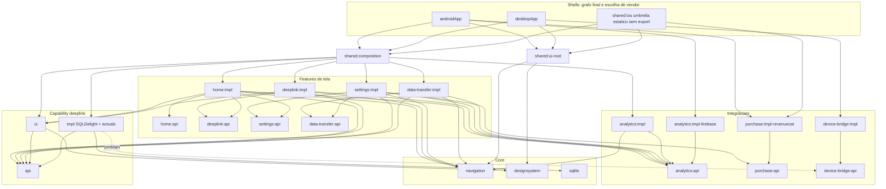

# Modularização para apps enterprise KMP/CMP: existe algo melhor que api/impl?

> **Emendas:** [2026-09-27-capability-vs-feature.md](2026-09-27-capability-vs-feature.md) §6 prevalece sobre este documento em três pontos: o nome do tier (`capability` → `domain` recomendado), o schema (ADR-014) e o critério para criar um tier (ADR-003/004).

Data: 2026-09-27
Escopo: qual a modularização ideal para um app **empresarial** Kotlin Multiplatform + Compose Multiplatform: muitas features e times, várias ferramentas externas (analytics, crash, flags, pagamentos). O DeepLink Launcher entra como caso concreto, não como objeto de auditoria.

Como foi feito:
- 9 pesquisas web independentes em fontes primárias: blogs de engenharia, documentação oficial, repositórios e releases.
- Cada pesquisa passou por um verificador adversarial que buscou as fontes de novo e descartou afirmações sem base.
- Resultado: 313 achados verificados em [2026-09-27-modularization-sources.md](2026-09-27-modularization-sources.md). Os IDs citados aqui (TAX-xx, DI-xx, NAV-xx…) apontam para lá.
- Três arquiteturas-alvo foram desenhadas de forma independente (rigor "app platform", mainstream pragmático e KMP/performance-first), um juiz comparou as três e um crítico revisou o resultado contra o código real.

Os problemas de corretude de dados (F1–F14) estão em [2026-09-19-architecture-review.md](2026-09-19-architecture-review.md) e não são repetidos aqui.

---

## 0. Resposta direta

**api/impl é a peça certa, mas não é a arquitetura.** Em 2026, os codebases grandes que documentam sua estrutura convergem em cinco ideias. api/impl é só uma delas:

1. **Taxonomia de tipos de módulo com regras de dependência por tipo.** Feature de tela, capability (domínio + dados compartilhados), integração com vendor, core, shells, testing, apps de dev. O tipo determina o que o módulo pode importar.
2. **api/impl seletivo, não universal.** Um `:api` existe quando há (a) consumidor em outro módulo **e** (b) substituição real (plataforma, vendor, fake, variante de app) ou fronteira de time. Fontes: App Platform (TAX-03), guia oficial Android (GOV-27, LAY-04) e Slack, que recusa pares obrigatórios pelo custo de configuração (BP-08, LAY-09).
3. **DI por contribuição.** Cada `:impl` se registra sozinho no grafo e ninguém mantém lista central. Square, Cash App, Vinted, Freeletics, BandLab e App Platform migraram para **Metro**, que é estável desde abril/2026 (DI-03, DI-12..15, DI-19). O Anvil está deprecado.
4. **Regras executáveis no build.** Regra de módulo que vive só num markdown já foi violada. Exemplos: o checker do App Platform (TAX-04), o verificador da Dropbox (TAX-19) e DAGP + regras de grafo (GOV-01, GOV-02).
5. **Contratos ABI-finos.** Um `:api` gordo (modelos de UI, formatação, rotas e domínio misturados) faz toda mudança de UI recompilar consumidores que só queriam o domínio (BP-04, BP-05, LAY-32). Nesse ponto o ganho de build do api/impl desaparece.

**O que isso significa para este repo:** o maior problema não é o padrão api/impl, e sim o fato de que `feature:deeplink` não é uma feature. Ele é uma **capability** (o domínio "deeplink/folder" e seus dados), consumida por home, settings, data-transfer e ui-component, mas modelada como tela. Por isso o `deeplink:api` tem 33 arquivos que misturam domínio, UI models, formatação, rotas e tipos JVM. A mudança estrutural de maior retorno é separar **capability** de **feature de tela** (§4).

**Stack recomendada para KMP/CMP enterprise (setembro/2026):**

| Eixo | Escolha | Por quê |
|---|---|---|
| Taxonomia | `:core`, `:integration`, `:capability`, `:feature`, `:shared`/shells, `:dev`, com papéis `api`, `impl`, `impl-<variante>`, `internal`, `testing`, `ui`, `demo` | §3 |
| DI | Metro 1.4.x, com grafo final por plataforma e contribuições nos `:impl` | Checagem em compilação, KMP nativo, sem KSP (§6.1) |
| Navegação | Navigation 3 (JetBrains `navigation3-ui` 1.1.2 via CMP 1.12.1), keys nas `:api` e entry installers contribuídos | Padrão Google + JetBrains (§6.2) |
| Vendors | Porta neutra em `:integration:x:api`; SDK só em `:integration:x:impl-<vendor>`; iOS via bridge Swift | §6.3 |
| iOS | Um único umbrella, estático, **sem `export()`**, separado da composition root | §6.4 |
| Testes | Fakes do dono em `:testing` (commonMain) + contract tests; sem mock library | §6.7 |
| Governança | Gramática de paths no settings, `checkModuleRules` por projeto (compatível com Isolated Projects), detekt `ForbiddenImport`, ABI validation do KGP, DAGP | §6.8 |

**O que modularização não resolve:**
- O link Kotlin/Native do framework iOS é monolítico. Dividir módulos acelera a compilação de cada klib, mas não o link final (BP-14).
- Mais módulos deixam o build mais rápido, mas o sync da IDE mais lento. A Pocket Casts mediu build 3× mais rápido e sync 5× mais lento ([mobile.blog](https://mobile.blog/2025/09/08/gradle-modularization-delivers-3x-faster-android-builds/)). A Square chegou a sync de 20–25 min perto de 4.400 módulos ([Square](https://developer.squareup.com/blog/keeping-ide-sync-times-at-bay-a-historical-perspective/), BP-09). A Grab, com ~2.000 módulos, cortou o sync de ~35 min com um focus plugin (TAX-17, BP-10).

---

## 1. Ponto de partida (resumo)

O que já está certo:
- Não há ciclos.
- Nenhuma feature `impl` depende de outra `impl`.
- `:shared` funciona como composition root.
- A navegação já usa multibinding: `AppGraph(getAll())` coleta os `NavigationGraph` contribuídos. É o mesmo padrão dos "entry installers" do Nav3.
- Vendors ficam atrás de interface, com no-op por plataforma.
- `device-bridge` é JVM puro, o que está correto: módulo de uma plataforma só não deveria ser KMP.

Onde o desenho atual não escala:

| # | Sintoma | Evidência | Consequência em escala |
|---|---|---|---|
| 1 | `deeplink:api` é três contratos num só: domínio, apresentação (`ui/model`, `ui/formatting`, `application/Enrich*`) e rotas, além de tipos JVM (`DeepLinkTarget` expõe `DeviceBridge.Platform`) | 33 arquivos; 5 módulos consumidores | Mudança de UI invalida a compilação de `data-transfer:impl` e `settings:impl`, que só usam repositórios |
| 2 | Toda `feature:*:api` depende de `core:navigation`, que traz navigation-compose, Koin e coroutines | build files | Contrato de domínio acoplado ao runtime de UI |
| 3 | api criada por convenção | `home:api` sem consumidor; `ImportDeepLinks`/`ExportDeepLinks` sem consumidor externo; `settings:api` com só uma rota | Superfície pública inútil |
| 4 | A raiz importa tipos de navegação do `impl` | `shared/App.kt` usa `home.impl...HomeRoute`; `AnalyticsScreenTracker.kt` usa `settings.impl...SettingsRoute` | O `:api` vira decoração |
| 5 | 14 interfaces de use case 1:1 + `singleOf(::XImpl) bind X::class` | `deeplink/impl/di/Module.kt` | ABI inflada; a fronteira real se perde |
| 6 | Lista manual de 14 módulos Koin em `AppInitializer` | `shared/AppInitializer.kt` | Toda feature nova edita `:shared`, que vira hotspot de merge |
| 7 | `:shared` acumula composition root, UI raiz e framework iOS | `shared/build.gradle.kts` (`baseName = "shared"`) | Não há como dar posse por plataforma |
| 8 | Regras só em markdown | `docs/MODULARIZATION.md` lista a checagem como "future"; CI roda `testDebugUnitTest` + `ktlint` | Violação silenciosa |
| 9 | Convention KMP aplica 5 alvos a todo módulo (inclui `iosX64`) e Compose injeta um bundle de dependências | `build-logic` | Custo por módulo; o grafo real fica escondido do DAGP |
| 10 | Arestas mortas | `purchase:api → core:navigation`, `deeplink:api → core:preferences` | Ruído no grafo |

---

## 2. Como apps grandes modularizam hoje

### 2.1 Panorama verificado

| Quem | Escala | Taxonomia | DI | Observação | IDs |
|---|---|---|---|---|---|
| Square (Block) | 7.000+ módulos, 300+ dev apps, 22 apps de produção (2026) | `:public` / `:impl-real` / `:impl-fake` / wiring; impl→impl proibido | Dagger+Anvil → Metro (9 meses, com interop) | Mantém wiring modules como legado de escala; avaliou e rejeitou Bazel ([Stampeding Elephants](https://developer.squareup.com/blog/stampeding-elephants/)) | TAX-07, TAX-08, BP-09, DI-12 |
| App Platform (ex-Amazon, hoje independente) | Produção em apps de Amazon Delivery | `:public`, `:impl(-<variante>)`, `:internal`, `:testing`, `:*-robots`, `:app`; só `:app` depende de `:impl` | Metro (padrão) ou kotlin-inject-anvil | Sem wiring: as impls se contribuem sozinhas, e o grafo final fica no app. Checker Gradle incluído | TAX-01..06, DI-19 |
| Now in Android (Google) | Referência | `:feature:*:{api,impl}`, onde **api = só NavKeys**; `:core:{data,database,datastore,model,navigation,testing,…}` | Hilt | Nav3; `org.gradle.isolated-projects=true` já ligado | TAX-09, NAV-12 |
| Slack | Android (2022) | Features / Services / Libraries; api/impl só para quebrar ciclos | Anvil (histórico) | Services = lógica de negócio sem UI (a "capability") | BP-08, LAY-09 |
| Cash App | ~1.500 módulos | — | Anvil → Metro | Incremental ~59% mais rápido, somando Metro e K2 | DI-13 |
| Vinted | Algumas centenas de módulos | — | Dagger+Anvil → Metro numa passada, sem interop | CI 6–26% mais rápido | DI-14 |
| Grab | ~2.000 módulos (2026) | Hoje pares `:x-api` / `:x-impl`; em 2021 era Base/Shared/Feature/Kit | Dagger | Build via Bazel e sync via Gradle, com "focus" plugin (sync de ~35 min para menos de 2 min) | TAX-17, TAX-18, BP-10 |
| Dropbox (2019) | — | 4 camadas: Product / Core / Base / External | — | Verificador de camadas próprio em buildSrc | TAX-19 |
| Airbnb iOS (2021) | — | 12 tipos de módulo | — | Taxonomia por tipo, não por par | TAX-15 |
| Kraken | ~600 módulos, 80% KMP | — | — | DAGP: build −70% e sync −85% ([autonomousapps](https://autonomousapps.com/blog/announcing-dagp-kmp/post/)) | GOV-01 (cobertura KMP do DAGP) |
| KotlinConf app (JetBrains) | Pequeno | Grafo em `app/shared` | Metro 1.4, com `AppGraph` comum e grafo por plataforma | Referência de Metro em CMP | DI-08 |
| Bitkey (Block) | KMP | Umbrella `:shared:xc-framework` separado da composição `:shared:app-component:impl` | — | Exporta 22 módulos e 7 de teste; esse excesso **não** deve ser copiado | T5-18 |

### 2.2 Onde há consenso

1. **Contrato separado da implementação, com impl→impl proibido e só o app enxergando impls.** Seguem isso NiA, Square, App Platform, Slack iOS, Grab e o Ryan Harter, que implantou api/impl na Dropbox ([2026](https://ryanharter.com/blog/2026/07/a-great-gradle-module-structure/)).
2. **O ganho de build vem da estabilidade da ABI do contrato, não da configuração `api` vs `implementation` do Gradle.** Zac Sweers resume: "configurations don't avoid compilations, just control visibility". O que evita recompilação é um `:api` pequeno que raramente muda (BP-04, BP-05).
3. **O DI por contribuição matou o wiring central.** Metro é o sucessor de fato do Anvil. Hilt continua sendo o padrão do Google, mas só Android.
4. **Fakes ficam em módulos `:testing` separados, não em test fixtures**, que têm atrito com Kotlin/KMP (TST-10, TST-11).
5. **As regras são verificadas por máquina.**
6. **Em KMP, um umbrella iOS por app.**

### 2.3 Onde há divergência (e o que decide)

| Tema | Lado A | Lado B | Critério |
|---|---|---|---|
| Wiring module | Square mantém | App Platform e Harter dispensam, porque a impl se contribui | Com Metro ou kotlin-inject-anvil, wiring só se paga se a impl for publicada para consumidores com outro DI |
| api/impl vs "API/DI" (estrela) | Contrato do produtor | O consumidor declara a interface e o app faz o bind (galex.dev) | Uma fonte só, sem dados de escala; não adotar (TAX-26) |
| Tipos vs pares | Slack/Airbnb/Dropbox por tipo | NiA/Grab 2026 por par | Não são excludentes: tipo primeiro, par onde há inversão |
| DI compile-time vs runtime | Metro, Dagger | Koin (agora com compiler plugin, DI-21) | Em escala, grafo validado em compilação por plataforma |
| Build vs sync | Mais módulos | Menos módulos | Medir. Mitigar com Isolated Projects (BP-12), focus plugins e parallel import |
| Gradle vs Bazel | Square e Dropbox ficaram no Gradle | Grab (build) e Slack iOS usam Bazel | Irrelevante abaixo de milhares de módulos |

---

## 3. As alternativas de modularização comparadas

A pergunta "existe algo melhor que api/impl?" tem resposta mais precisa se separarmos os eixos. Cada estratégia abaixo responde a uma pergunta diferente, e várias se combinam.

| Estratégia | Responde a | Vale para enterprise KMP? | Veredito |
|---|---|---|---|
| **api/impl universal** ("toda feature tem par") | Isolamento de compilação | Parcial. Gera APIs sem consumidor e dobra os projetos a configurar (BP-08) | ❌ como regra; ✅ como ferramenta |
| **Tipos de módulo + api/impl seletivo** | O que pode depender de quê | Sim. É o consenso atual | ✅ **base recomendada** |
| **Capability separada de feature** (bounded context, LAY-26) | Onde ficam domínio e dados compartilhados | Sim: "services" do Slack, data modules do Google, libraries do Element X | ✅ **a correção principal aqui** |
| **Layer-per-feature** (`:x:data`, `:x:domain`, `:x:presentation`) | Separação de camadas | Nenhuma fonte primária de empresa grande prescreve; multiplica módulos | ❌ camadas viram pacotes (verificados por detekt/Konsist) |
| **Camadas globais** (`:data`, `:domain`, `:ui`) | Simplicidade | Não escala: mistura features e times | ❌ acima de protótipo |
| **Camadas por diretório** (Dropbox) | Direção das dependências | Sim, embutidas no path: `core → integration → capability → feature → shared/app` | ✅ combinado |
| **App Platform / contribuição** (DI agrega tudo, só o app vê impl) | Composição sem lista central | Sim | ✅ via Metro |
| **Plugin points com kill switch** (Uber, TAX-20) | Desligar feature em runtime | Sim, via `EntryInstaller` que consulta flag | ✅ opcional |
| **Registro central de rotas** (Tivi) | Navegação simples | Só com um time; com vários vira hotspot | ⚠️ não em enterprise |
| **Frameworks de presenter** (Circuit, App Platform presenters, Decompose) | Navegação e estado testáveis sem UI; SwiftUI nativo | Quando a navegação precisa dirigir UI nativa | ⚠️ gatilho, não padrão |
| **Dynamic feature modules** | Entrega sob demanda (Play) | Android-only; nenhuma fonte grande usa como estratégia de modularização | ❌ em KMP |
| **Bazel/Buck** | Builds de milhares de módulos | `rules_kotlin` não cobre Kotlin/Native e o Buck2 open-source é early-stage (GOV-23); Square rejeitou | ❌ em KMP com iOS |

---

## 4. A modularização recomendada

### 4.1 Gramática de paths

Cada tipo de módulo tem um formato de path. O settings valida esse formato (§6.8):

```
Shells:           :androidApp | :desktopApp | :baselineprofile          (iosApp/ é Xcode)
Montagem:         :shared:(ios|composition|ui-root)
Core:             :core:<nome>                  (vira :core:<nome>:(api|impl|testing) só com gatilho)
Integração:       :integration:<lib>:(api|impl|impl-<vendor>|internal|testing)
Capability:       :capability:<dominio>:(api|impl|impl-<variante>|internal|testing|ui)
Feature de tela:  :feature:<feature>:(api|impl|presentation|ui|demo)
Dev:              :dev:<nome>
```

Para multi-app ou white-label, o padrão de montagem se generaliza para `:app:<nome>:(android|desktop|ios|composition)`. Marca, tema, `applicationId` e projeto Firebase ficam no shell de cada app, e os tokens de marca chegam ao design system via `@Provides` do shell.

### 4.2 Tipos e regras

| Tipo | Contém | Pode depender de | Não pode depender de |
|---|---|---|---|
| **app-shell** | Entry point e **grafo DI final da plataforma**; escolha de vendor; manifest; plugins Firebase | composition, ui-root, integration-api/impl/vendor, core | feature/capability direto; testing; dev |
| **ios-umbrella** (`:shared:ios`) | **Único** framework Kotlin: estático, sem `export()`, com `IosAppGraph`, fachada Swift e interfaces de bridge | composition, ui-root, integration-api/vendor (iOS), core | segundo framework; módulos só Android/JVM |
| **composition** | `interface AppGraph` sem anotação (em commonMain) + `api()` para todo módulo que contribui (o Metro não agrega transitivos, DI-04) | feature, capability, integration api/impl, ui-root, core | integration-vendor (quem escolhe é o shell); testing |
| **root-ui** | `AppRoot`, `NavDisplay`, `Navigator`, scenes, tema, snackbar | core, core-ui | qualquer `impl`, feature, capability, integration |
| **feature-api** | **Só** NavKeys `@Serializable` com IDs primitivos, e tipos de resultado | **nenhum módulo do projeto** (externo: `navigation3-runtime`, serialization) | tudo do projeto, Compose UI, DI, analytics |
| **feature-impl** | Telas, ViewModels, `EntryInstaller`, metadata de tela, eventos de analytics internos, use cases locais concretos; tudo `internal` | própria api, api de outras features, capability-api/ui, integration-api, core, core-ui | outro `impl`, SQLDelight/DataStore direto, SDK de vendor |
| **capability-api** | Contrato de um bounded context: modelos, repositórios com comandos por ID, ports com substituição real. Sem UI, navegação, formatação ou tipo de vendor | core não-UI; outra capability-api só via allowlist | feature, core-ui, navegação, integration, impl |
| **capability-impl** | Schema SQLDelight e migrações do domínio, repositórios atômicos, actuals de plataforma, contribuições DI | própria api/internal, outras capability-api, integration-api, core | feature, UI, outro impl |
| **capability-ui** | Widgets e mappers da entidade usados por **2+ features** | própria api, core, core-ui | impl, feature, integration, navegação |
| **integration-api** | Porta neutra do vendor + SPI do adapter (`AnalyticsTracker` + `AnalyticsSink`) | core não-UI | SDK de vendor, feature, capability |
| **integration-impl** | Pipeline neutro: consent gate, scrub, fan-out, observers, initializers | própria api/internal, core | SDK de vendor, outro impl |
| **integration-vendor** (`impl-firebase`, `impl-revenuecat`, `impl-noop`) | **Único lugar** com import, coordenada e BOM de vendor | própria api/internal, core, SDK | impl irmão, feature, capability |
| **internal** | Código compartilhado entre impls **da mesma lib**, criado sob demanda | própria api | outras libs |
| **testing** | Fakes do dono, suítes de contrato abstratas, builders e robots, em commonMain | a api que imita, core, outros testing | qualquer impl; nunca no runtime |
| **core / core-ui** | Infra agnóstica de produto; design system e resources | core (sem ciclo) | feature, capability, integration, shared; substantivos de produto |
| **dev** | App desktop JVM que monta uma feature com fakes | quase tudo | ninguém depende dele |

Regras transversais:
- Só composition, umbrella, shells e dev apontam para `*:impl`.
- `impl → impl` é proibido. A única exceção é `:feature:x:ui → :feature:x:presentation`, dentro da mesma feature.
- Nenhuma aresta aponta para uma camada acima.
- `:testing` nunca entra no runtime.
- Nenhum tipo de vendor atravessa uma `:api`.
- `:core:navigation` só é visível para feature, root-ui, composition, integration-impl, testing e dev.

### 4.3 Checklist: quando criar cada variante

**Crie `:api` se** houver consumidor em outro módulo **e** (substituição **ou** fronteira de time). Se só houver consumidor e o código for utilitário ou UI kit, faça um módulo sem impl (TAX-03). Se não houver consumidor externo, use pacotes.

| Variante | Justifica-se quando | Não se justifica quando |
|---|---|---|
| `:api` | O checklist acima vale | Não tem consumidor (hoje: `home:api`) ou espelha tipos da impl |
| `:impl-<variante>` | Vendor, plataforma ou app variam no build | A troca precisa ser em runtime: nesse caso é feature flag |
| `:internal` | 2+ impls da mesma lib compartilham código | "Por via das dúvidas" |
| `:testing` | api consumida por 2+ módulos; toda integração com SDK | A impl real já é rápida e determinística |
| `:impl-fake` de runtime | Dev apps ou device tests trocam a impl via Gradle (modelo Square) | Demos declaram o próprio grafo com fakes de `:testing` |
| `:wiring` | DI sem agregação, ou impl publicada para outro DI | Com Metro (agregação nativa) |
| `:demo` | Loop do app completo lento; time separado; iterar UI com fakes (barato no desktop JVM) | Como substituto do teste do app completo |
| `:ui` (capability) | 2+ features renderizam a mesma entidade | Só uma feature usa |
| `:presentation` + `:ui` (feature) | Alguma plataforma renderiza a feature em SwiftUI nativo | App 100% CMP |
| `:robots` | Suíte de UI tests relevante, cruzando features | Hoje (cabe em `:testing`) |

**Nome: manter `:api`.** O vocabulário `:public` só se paga se você adotar o checker do App Platform, que exige esse nome (TAX-04).

### 4.4 Capability vs feature

| | Feature de tela | Capability | Integração | Core |
|---|---|---|---|---|
| É | Fatia vertical: telas, estado, navegação | Bounded context: modelos, regras, dados, efeitos de plataforma | Capability voltada a vendor externo | Infra agnóstica de produto |
| A `:api` exporta | Só NavKeys e resultados | Modelos, repositórios, ports | Porta neutra + SPI | Contratos utilitários |
| UI? | Sim (na impl) | Não; UI compartilhada vai em `:ui` | Não | Só core-ui |
| Dona de dados? | Nunca de dados que outros leem | Sim: schema e migrações | Não | Infra (driver, DataStore) |
| Aqui | home, deeplink (telas), settings, data-transfer | deeplink (domínio) | analytics, purchase, device-bridge, crash, flags | navigation, sqlite, designsystem |

Perguntas para classificar código novo:
1. Outra feature precisa desses dados ou dessa regra? Capability.
2. É tela ou fluxo? Feature.
3. Fala com SDK ou processo externo? Integração.
4. Serve a qualquer produto? Core.

**Use cases: interface só onde há actual ou fake entre módulos.** Os 14 use cases de `deeplink:api` se reduzem a cerca de 9 ports:

| Port | Absorve |
|---|---|
| `LaunchDeepLink`, `ShareDeepLink` | mantidos (actual por plataforma) |
| `DeepLinkShortcuts` | `PinDeepLinkToHomeScreen` e `DeepLinkShortcutManager` |
| `DeepLinkHandlerResolver` | `GetDeepLinkHandlers`, `GetDeepLinkHandlerInfo`, `GetDeepLinkHandlerIcon` (o ícone vira `HandlerIcon` no domínio) |
| `DeepLinkParser` | `ValidateDeepLink` e `GetDeepLinkMetadata` |
| Comandos atômicos por ID no repositório | `DeleteDeepLink`, `DeleteAllDeepLinks`, `DuplicateDeepLink` e `LinkDeepLinkToFolder`, junto com as correções F1–F3 |
| `DeepLinkSuggestions` | `GetAutoSuggestionLinks` |
| `DeepLinkTargetSelector` (jvmMain) | `DeepLinkTarget` e `DeepLinkTargetStateManager`, com `TargetPlatform` próprio em vez de `DeviceBridge.Platform` |

`GetDeepLinksAndFolderStream` vira classe `internal` em `home:impl`, porque `HomeViewModel` é o único consumidor. O resto vira classe concreta `internal`: o Google trata o domain layer como opcional e alerta contra forçar todo acesso por use cases (LAY-01).

---

## 5. Aplicado a este repo: árvore-alvo

```
SHELLS (possuem o grafo final da plataforma e escolhem vendor)
:androidApp                        AndroidAppGraph; Application; plugins Firebase; deps: composition, ui-root,
                                   analytics:impl-firebase, crash:impl-crashlytics, purchase:impl-revenuecat
:desktopApp                        DesktopAppGraph (jvmMain); deps: composition, ui-root, purchase:impl-noop, device-bridge:impl
:baselineprofile                   perfil regenerado a cada fase estrutural
iosApp/ (Xcode)                    bridges Swift (Firebase iOS via SwiftPM); chama Main_iosKt.startApp(bridges:)

MONTAGEM
:shared:ios            [iOS]       ← :shared iosMain. baseName "shared", isStatic = true, SEM export(); IosAppGraph; IosBridges
:shared:composition    [A,I,J]     ← AppInitializer + di/*. interface AppGraph; @StartKey HomeKey; api() em todo módulo contribuinte
:shared:ui-root        [A,I,J]+C   ← App.kt, anim/*. AppRoot, NavDisplay, BackStackNavigator, scenes, tema

FEATURES DE TELA
:feature:home:api                  HomeKey (consumidor: composition, como start key)
:feature:home:impl                 + GetDeepLinksAndFolderStream (internal); jvmMain: dropdown de alvo via DeepLinkTargetSelector
:feature:deeplink:api              AddFolderKey, FolderDetailsKey(folderId), PickDeepLinkForFolderKey(folderId), DeepLinkDetailsKey(id, showFolder)
:feature:deeplink:impl             ← deeplink:impl ui/** + DeepLinkDetailsModel + EnrichDeepLinkForDetails (internal)
:feature:settings:api              SettingsKey
:feature:settings:impl             sheets viram entries com scene metadata; UrlOpener no lugar de LaunchDeepLink para links de ajuda
:feature:data-transfer:api         ImportDataKey, ExportDataKey
:feature:data-transfer:impl        + Import/Export/Preview como internal
:feature:deeplink:demo  [J]+C      opcional: app desktop com feature:deeplink:impl + fakes

CAPABILITY
:capability:deeplink:api           ← domain/model, repositórios com comandos por ID, ~9 ports (§4.4)
:capability:deeplink:impl          ← deeplink:impl data/**, domain/**, platform/** + schema .sq/.sqm de core:database
                                   (MESMO nome de banco, pacote e arquivo)
:capability:deeplink:ui    +C      ← feature:deeplink:ui-component + ui/formatting + ui/model/{DeepLinkListItem,FolderListItem}
                                   + EnrichDeepLinksForList → DeepLinkListItemMapper
:capability:deeplink:testing       FakeDeepLinkRepository, FakeFolderRepository, FakeLaunchDeepLink, DeepLinkRepositoryContract

INTEGRAÇÕES (vendor só em impl-*)
:integration:analytics:{api, impl, impl-firebase[A], testing}
:integration:crash:{api, impl-crashlytics[A], testing}          ← SDK Crashlytics sai do :androidApp
:integration:flags:{api, impl-static, testing}
:integration:purchase:{api, impl-revenuecat[A, I com purchases-kmp 3.x], impl-noop, testing}
:integration:device-bridge:{api, impl, testing}   [kotlin-jvm]
(decidir) Firebase Perf: :integration:perf:impl-firebase ou remover plugin + SDK

CORE (sem api/impl até haver gatilho)
:core:navigation     reescrito sobre navigation3-runtime: Navigator, EntryInstaller, NavKeySerializers, NavigationObserver, ScreenNameKey
:core:designsystem   +C  dono das fontes e ícones compartilhados (acessores tipados, sem expor Res)
:core:resources      +C  esvaziado aos poucos: cada módulo com UI passa a ter composeResources próprio (§6.5)
:core:ui, :core:ui-event
:core:coroutines     + CoroutineDispatchers injetável
:core:date           + Clock e IdGenerator injetáveis
:core:platform       + AppInitializer(order, mode), UrlOpener
:core:file           expect fun → interfaces + contribuições por plataforma
:core:preferences    fábrica DataStore + AppTheme + DataCollectionSettings; chaves de feature nascem no dono
:core:sqlite         ← core:database sem schema: SqlDriverFactory + actuals + column adapters
:core:logging        Kermit + Set<LogWriter> contribuído (substitui println)
:core:testing        TestDispatchers, FixedClock, FakeNavigator

DEV
:dev:catalog  [J]+C  catálogo do design system + capability:deeplink:ui com fakes; debug menu de flags

REMOVIDOS
:shared → :shared:{ios,composition,ui-root}; :feature:deeplink:ui-component → :capability:deeplink:ui;
:core:database → :core:sqlite + schema na capability; :library:* → :integration:*;
AnalyticsUserProperties.kt (0 referências); AnalyticsScreenTracker.kt; noOpMain → impl-noop / set vazio
```

Legenda: A = android (`com.android.kotlin.multiplatform.library`), I = iosArm64 + iosSimulatorArm64, J = jvm, +C = Compose.

Contagem: 48 módulos base (3 shells + 3 montagem + 8 features + 4 capability + 17 integrações + 13 core) contra 30 hoje, mais 2 de dev. O crescimento vem quase todo de `:testing` e `impl-<vendor>`, que são folhas baratas de compilar.



Leitura do grafo:
- Features só se conhecem por `:api` de keys.
- O domínio compartilhado vive na capability, que não conhece UI.
- Vendor só aparece nas folhas `impl-*` escolhidas pelos shells.
- A raiz de UI não conhece nenhuma feature: a start key chega pelo grafo DI.

---

## 6. Pontos de atenção por tema

### 6.1 DI: Metro com contribuições e grafo por plataforma

**Por que Metro:**
- É compiler plugin (K2), sem KSP. Isso importa em KMP, onde KSP precisa ser configurado por alvo.
- Valida o grafo em compilação, **por plataforma**.
- Tem agregação estilo Anvil embutida (DI-03).
- Tem 1.0 estável desde abril/2026; a versão atual é 1.4.5 (2026-09-24).
- Os ganhos de build publicados misturam Metro com K2 e com a remoção de KAPT/KSP. Os benchmarks do próprio Metro são do autor (DI-16).

**Pré-requisito:** Kotlin ≥ 2.3.20. A agregação multi-módulo em Android/Apple não funciona direito em 2.3.0/2.3.10, que é a versão do repo (DI-02). O alvo é Kotlin 2.4.20.

**Custo:** não há interop com Koin, então a migração é numa passada (DI-28), como fez a Vinted (DI-14). Os cerca de 20–25 `koinInject`, `koinViewModel` e `get` viram injeção por construtor.

**Regras:**
1. Contribuições vivem em `:impl` (e em core, só para os próprios contratos). As classes ficam `internal` com `generateContributionProviders`.
2. **Grafo final só em código de plataforma:** `AndroidAppGraph` em `:androidApp`, `DesktopAppGraph` em `:desktopApp`, `IosAppGraph` em `:shared:ios`. O commonMain tem só uma `interface AppGraph` sem anotação (DI-07). Uma contribuição no `androidMain` de uma impl só chega ao grafo Android, o que elimina `expect val platformModule` e `noOpMain`.
3. O dono do grafo precisa enxergar **diretamente** cada módulo que contribui; o Metro não agrega transitivos (DI-04). Por isso a composição usa `api()`. A checagem `checkMainMetroHiddenDependencies` ainda não foi lançada e cobre só JVM/Android (DI-32).
4. **Extension points são multibindings, nunca listas:** `Set<EntryInstaller>`, `Set<NavKeySerializers>`, `Set<NavigationObserver>`, `Set<AppInitializer>`, `Set<AnalyticsSink>`, `Set<FeatureFlagDeclarations>`, mapa de ViewModels. Sets não têm ordem, então a ordem é um campo explícito (DI-31).
5. Sets vazios são erro de compilação por padrão. Use `@Multibinds(allowEmpty = true)` só onde o set pode mesmo ficar vazio (os sinks de analytics no desktop) e teste o tamanho do set por plataforma. Esse é o único caso silencioso: `AppScope` errado normalmente vira `MissingBinding`.
6. Uma versão de Metro e uma janela de Kotlin no repo inteiro.
7. O grafo Android fornece `Application` **e** um binding de `Context` (hoje `App.kt` registra `single<Context>`). Sem isso, dá `MissingBinding`.

```kotlin
// :capability:deeplink:impl (commonMain)
@SingleIn(AppScope::class)
@ContributesBinding(AppScope::class)
@Inject
internal class SqlDeepLinkRepository(
    private val db: DeepLinkLauncherDatabase,
    private val dispatchers: CoroutineDispatchers,
) : DeepLinkRepository

// :capability:deeplink:impl (androidMain) — chega só ao AndroidAppGraph
@ContributesBinding(AppScope::class)
@Inject
internal class AndroidLaunchDeepLink(private val context: Context) : LaunchDeepLink

// :feature:home:impl
@Inject
@ViewModelKey(HomeViewModel::class)
@ContributesIntoMap(AppScope::class)
internal class HomeViewModel(
    private val stream: GetDeepLinksAndFolderStream,
    private val analytics: AnalyticsTracker,
) : ViewModel()

// :shared:composition (commonMain) — SEM @DependencyGraph
interface AppGraph : RootUiGraph {
    val initializers: Set<AppInitializer>
}

// :androidApp
@DependencyGraph(AppScope::class)
interface AndroidAppGraph : AppGraph {
    @Binds val Application.bindContext: Context
    @DependencyGraph.Factory
    fun interface Factory { fun create(@Provides application: Application): AndroidAppGraph }
}
```

**Escopo de sessão (quando houver login).** É um ponto crítico em app empresarial:
- `@GraphExtension(SessionScope::class)`, criado no login e descartado no logout (LAY-12).
- Repositórios com dados de usuário ficam só em `SessionScope`. Uma regra detekt barra `@SingleIn(AppScope::class)` em pacotes `*.session.*`.
- Um `MetroViewModelFactory` por `SessionGraph`.
- No logout: `resetTo(LoginKey)`, descartar o grafo e limpar os user IDs dos SDKs (analytics, RevenueCat, crash).
- Teste obrigatório: "login A → logout → login B não vê dados de A".

**Alternativa, se Metro estiver bloqueado:** Koin 4.2.2 + Koin Compiler Plugin 1.2.1. Um `@Module @Configuration` por impl e `startKoin<App>()` validam o grafo no entry point (DI-21). Limites:
- folhas sem entry point não recebem diagnóstico;
- `getAll()` não é validado e não vem ordenado desde a 4.2;
- a descoberta de `@Configuration` em klib nativo não está documentada.

**Rede de segurança imediata**, ainda no Koin 4.1: um `jvmTest` com `Module.verify()`.

### 6.2 Navegação: Navigation 3 com contribuições

Situação em setembro/2026:
- Google Nav3 1.0 estável desde nov/2025 (NAV-01); Google 1.2.0 estável em 2026-09-23, com deep links KMP e result API (NAV-03).
- JetBrains: o CMP 1.12.1 fixa `navigation3-ui` **1.1.2**. A linha 1.2 no CMP ainda é beta (NAV-05).
- **Fique no 1.1.x.** Este app não tem deep links de entrada nem resultados via navegação.
- CMP ≥ 1.11 e Nav3 ≥ 1.1 **não publicam `iosX64`**, então esse alvo precisa sair antes (NAV-30). O `iosX64` não está deprecado no Kotlin (Tier 3, T5-13); quem o removeu foi a stack de UI.

```kotlin
// :core:navigation — só navigation3-runtime + serialization, sem DI
public interface Navigator { fun navigate(key: NavKey); fun goBack(); fun resetTo(vararg keys: NavKey) }
public fun interface EntryInstaller { fun EntryProviderScope<NavKey>.install(navigator: Navigator) }
public interface NavKeySerializers {
    val sampleKeys: List<NavKey>                                  // usado pelo teste de cobertura
    fun PolymorphicModuleBuilder<NavKey>.register()               // obrigatório em iOS/desktop (NAV-07)
}
public fun interface NavigationObserver { fun onScreenShown(key: NavKey, screenName: String?) }

// :feature:deeplink:api — só keys, IDs primitivos
@Serializable public data class FolderDetailsKey(val folderId: String) : NavKey

// :feature:deeplink:impl
@ContributesIntoSet(AppScope::class) @Inject
internal class DeepLinkEntries : EntryInstaller {
    override fun EntryProviderScope<NavKey>.install(navigator: Navigator) {
        entry<FolderDetailsKey>(metadata = screen("folder_details")) { key -> /* tela + assisted VM */ }
    }
}
```

Regras:
- **Features só se conhecem pela `:api`.** Sem canal global de navegação: somem `AppNavigator(Channel)`, `AppRoute` e `AppGraph(getAll())`. O ViewModel expõe estado e eventos, e a entry os traduz em chamadas ao `Navigator`.
- **A raiz é dona do back stack e não importa tipo de feature.** A start key chega por `@StartKey` no grafo.
- **Serialização em iOS é o risco nº 1 do Nav3 multi-módulo.** Em alvos não-JVM, toda NavKey precisa estar registrada no `SavedStateConfiguration` (NAV-07); se faltar uma, o app quebra ao ir para background. O teste de cobertura funciona assim:
  - cada `NavKeySerializers` declara `sampleKeys`;
  - o teste faz round-trip de serialização e confirma que `entryProvider(sampleKey)` não lança;
  - uma varredura de classpath em jvmTest (ClassGraph sobre os `*:api`, procurando subtipos de `NavKey`) compara o resultado com a união das `sampleKeys`.
- **Screen analytics é metadata, não código.**
  - Cada entry declara `ScreenNameKey`, e `:integration:analytics:impl` contribui um `NavigationObserver`.
  - Isso substitui a cadeia `runCatching { toRoute<X>() }`, que é frágil (F14), e o `AppRoute.analyticsScreenName`.
  - É uma escolha de design (NAV-15). A alternativa documentada é o `TrackScreenViewEvent` por tela do NiA (NAV-12).
  - Desligue o screen reporting automático do Firebase.
- **Dialogs e bottom sheets viram entries com scene metadata.**
- **Kill switch:** uma `EntryInstaller` pode consultar `FeatureFlag<Boolean>` antes de instalar. Como o `entryProvider` é criado dentro de `remember`, o efeito só aparece no próximo cold start.
- **Dependências:** alinhar Lifecycle JetBrains 2.9.6 → 2.11.0 e navigationevent 1.0.1 → 1.1.0, e adicionar `lifecycle-viewmodel-navigation3`. MetroX e Nav3 1.1.2 exigem essas versões.
- **Gatilho para presenters** (Circuit, App Platform, Decompose): features renderizadas em SwiftUI nativo, ou necessidade de testar navegação sem UI.

### 6.3 Integrações externas (analytics, crash, flags, purchase)

**Princípio:**
- Cada SDK fica atrás de uma porta neutra em `:integration:<x>:api`.
- Import, dependência e BOM do vendor só em `:integration:<x>:impl-<vendor>` (X-07).
- Shells e umbrella escolhem o vendor por plataforma.
- **Não use flavors Android para isso:** o plugin Android-KMP tem variante única (X-09).

**Analytics: pipeline fan-out tipado** (modelo Segment X-22, Element X LAY-18):

```kotlin
// :integration:analytics:api
public sealed interface AnalyticsValue {
    data class Text(val value: String) : AnalyticsValue
    data class Count(val value: Long) : AnalyticsValue
    data class Decimal(val value: Double) : AnalyticsValue
    data class Flag(val value: Boolean) : AnalyticsValue
}
public interface AnalyticsEvent { val name: String; val params: Map<String, AnalyticsValue> get() = emptyMap() }
public interface AnalyticsTracker { fun track(event: AnalyticsEvent); fun setUserProperty(name: String, value: String?) }
public interface AnalyticsSink {   // SPI para adapters
    fun log(name: String, params: Map<String, AnalyticsValue>)
    fun setUserProperty(name: String, value: String?)
    fun setCollectionEnabled(enabled: Boolean)
}

// :integration:analytics:impl — consent gate + scrub + fan-out
@SingleIn(AppScope::class) @ContributesBinding(AppScope::class) @Inject
internal class FanOutAnalyticsTracker(
    private val sinks: Set<AnalyticsSink>,
    private val settings: DataCollectionSettings,
) : AnalyticsTracker {
    override fun track(event: AnalyticsEvent) {
        if (!settings.analyticsAllowed.value) return
        val params = event.params.scrubbed()   // URLs de deep link podem conter credenciais
        sinks.forEach { it.log(event.name, params) }
    }
    override fun setUserProperty(name: String, value: String?) = sinks.forEach { it.setUserProperty(name, value) }
}
```

- Eventos concretos continuam `internal` na feature que os emite. Não existe catálogo central, e números continuam números: hoje o tracker recebe `Map<String, String>`.
- **Não há SDK KMP oficial do Firebase** (X-01). O GitLive cobre parte da API. No iOS, o sink é Swift e entra pela bridge do umbrella ("reverse import", X-02).
- **BOM:** o catálogo fixa `firebase-analytics = "22.4.0"` por fora do BOM 34.9.0, que alinha em 23.0.0 (GOV-NEW-04). O `impl-firebase` importa o BOM e o pin sai. Confirme com `dependencyInsight`.

**Crash:** vai para a base, não para laboratório. Hoje Crashlytics e Perf (SDK + plugin) estão em `:androidApp`.
- `:integration:crash:{api,impl-crashlytics,testing}` com `recordException`, `breadcrumb`, `setUserId` e `setCollectionEnabled`.
- No iOS: Crashlytics chamado do Swift via bridge + CrashKiOS para simbolicar stacks Kotlin. Sentry KMP (0.x) é a alternativa que também cobre desktop (X-10).
- **Perf:** decidir explicitamente entre criar `impl-firebase` ou remover o plugin e o SDK.

**Feature flags:** vão para a base.
- Cada flag é declarada junto ao dono (`FeatureFlag(key, default, owner, removeBy)`) e contribuída via `Set<FeatureFlagDeclarations>`. Não existe arquivo central.
- Comece com `impl-static`, que serve só os defaults.
- Vendors com SDK KMP oficial: ConfigCat e PostHog (0.x) (X-16). **LaunchDarkly e Statsig não têm cliente KMP** (X-15): exigem impl Android + impl Swift via bridge, ou OpenFeature.
- Um teste em jvmTest falha se `removeBy` já passou ou se `owner` não bate com o CODEOWNERS.
- Um debug menu em `:dev:catalog` lista as flags a partir do set.

**Purchase:**
- Resultado tipado: `Purchased | Cancelled | Failed(reason)`. Isso corrige o F4, em que um erro em offerings deixa a coroutine pendurada.
- O RevenueCat KMP 3.x troca o pod por cinterop gerado pelo Gradle e libera compras reais no iOS (X-11). Exige Kotlin 2.3.20 e Gradle 9.4.1.
- A chave do BuildKonfig passa a existir só em `impl-revenuecat`.

**Device bridge:**
- Continua `kotlin("jvm")`.
- A capability expõe `DeepLinkTargetSelector` com `TargetPlatform` próprio, então `DeviceBridge.Platform` deixa de vazar.
- Resultados tipados; ciclo de vida do processo dentro da impl.

**Startup:**
- `Set<AppInitializer>` com `order` explícito: crash 0, consentimento 100, purchase 200, `app_open` 900. Esses números são convenção deste design.
- Campo `mode: Eager | Deferred`: `Deferred` roda depois do primeiro frame (X-25).
- O logger do ComposeStabilityAnalyzer vira initializer só de debug.

**Distribuição iOS:** nenhuma integração nova via CocoaPods. O trunk fica read-only em 2026-12-02 (T5-32).

### 6.4 KMP/iOS: umbrella fino, sem export

1. **Um framework Kotlin por app, sempre.** Vários frameworks duplicam runtime e dependências, geram tipos incompatíveis e isolam estado (T5-01). Nada no roadmap muda isso.
2. **Separe empacotamento de composição.** `:shared` vira `:shared:ios` (empacotamento), `:shared:composition` e `:shared:ui-root`. Precedentes: Bitkey (T5-18) e Tivi. Com isso, mudança de feature nunca toca o build file do umbrella.
3. **Sem `export()`.** Exportar desliga dead-code elimination para o módulo exportado (T5-03). A superfície Swift fica em `startApp(bridges:)`, `MainViewController()` e interfaces de bridge com tipos primitivos, declaradas no próprio umbrella.
4. **Framework estático.** `isStatic = true`, como o template JetBrains e o app da KotlinConf. Com framework estático, o `linkerOpts("-lsqlite3")` do SQLDelight **não tem efeito**: o `-lsqlite3` vai para `OTHER_LDFLAGS` do Xcode.
5. **Mover o umbrella exige atualizar o Xcode:**
   - build phase: `./gradlew :shared:ios:embedAndSignAppleFrameworkForXcode`;
   - `FRAMEWORK_SEARCH_PATHS`: `$(SRCROOT)/../shared/ios/build/xcode-frameworks/...`.
6. **SDKs de vendor no iOS**, em ordem de preferência:
   - (a) implementação Swift injetada pela bridge: funciona com qualquer SDK e mantém o vendor fora do link Kotlin;
   - (b) SDK KMP oficial em `impl-<vendor>` (RevenueCat 3.x, Sentry, Datadog);
   - (c) `swiftPMDependencies {}` do KGP, que é Alpha.
7. **Nem SKIE nem Swift export agora.**
   - Swift export é Alpha desde o Kotlin 2.4.0 (T5-06) e é exclusivo com SKIE (T5-08).
   - Com uma superfície de duas funções, SKIE agrega pouco e trava upgrades de Kotlin: o suporte ao 2.4.20 saiu 18 dias depois do GA (T5-34).
   - **Gatilho:** quando alguma feature for renderizada em SwiftUI, dividir em `:presentation`/`:ui`, exportar só presentation e adotar SKIE (T5-15).
8. **Alvos por tipo de módulo**, não os 5 em tudo:
   - base: android + iosArm64 + iosSimulatorArm64 + jvm, sem `iosX64`;
   - `impl-firebase` e `impl-crashlytics`: só android;
   - device-bridge, demo e catalog: só JVM;
   - `:shared:ios`: só iOS.

   Cada alvo é uma compilação por módulo (BP-17).
9. **Link iOS:** modularizar não reduz o link (BP-14). O que ajuda:
   - `kotlin.incremental.native=true` (Beta no 2.4.20; −28% num app, BP-15);
   - `linkDebugFramework` de uma arquitetura só no loop interno;
   - cache de `~/.konan` no CI;
   - `-Xpartial-linkage-loglevel=ERROR`, **só nos alvos nativos**, para que skew de versão quebre o build em vez de virar `IrLinkageError` em runtime.
10. **Distribuição:** `embedAndSign` enquanto tudo estiver num repo. XCFramework via SwiftPM só quando surgir um time iOS separado. O KMMBridge multi-módulo não saiu (T5-10).

### 6.5 Resources, strings e i18n

É o ponto mais esquecido em modularização CMP. Hoje `:core:resources` tem `publicResClass = true`, e o `Res` dele é usado pelo design system (8 fontes Nunito), por `settings:impl` (JSONs do aboutlibraries), por `deeplink:impl` e por `ui-component`. Quase toda a UI é texto fixo, e o `HomeViewModel` gera texto de usuário.

Regras:
1. Cada módulo com UI tem seu próprio `composeResources` e um `Res` **internal**. Nenhum módulo importa o `Res` de outro.
2. Assets compartilhados (fontes, ícones) ficam em `:core:designsystem`, expostos por acessores tipados (`DLLTypography`, `DLLIcons.Folder`), nunca por `Res`.
3. ViewModels e capabilities emitem tipos de mensagem (sealed/enum), nunca `String` de UI. A tradução acontece na borda da UI.
4. Traduções (`values-xx`) pertencem ao módulo dono e ficam cobertas pelo CODEOWNERS.
5. Uma regra detekt proíbe literal `String` em `Text(...)` fora de previews.
6. No plugin Android-KMP, módulos com `composeResources` precisam de `androidResources.enable = true`.
7. **Ordem:** primeiro mover os assets para os donos, depois esvaziar `:core:resources` ou ligar `publicResClass=false`. Na ordem inversa, o design system perde as fontes.

### 6.6 Segurança e observabilidade

- **Secrets:**
  - chave pública de SDK pode ir no binário; nada privado entra em BuildKonfig;
  - secrets de CI só em jobs com `environment` protegido;
  - builds de PR e fork funcionam com defaults de debug.
- **Dados:**
  - URLs de deep link podem conter credenciais. O scrub do analytics vale também para breadcrumbs de crash e logs;
  - decida explicitamente sobre SQLite/DataStore em claro, leitura de clipboard, conteúdo do export e `allowBackup`.
- **Logs:** facade Kermit em `:core:logging` com `Set<LogWriter>`, writer de debug removido em release. Isso substitui os `println` (hoje há um em `AppInitializer` que roda em todas as builds).
- **R8:** consumer keep rules por módulo Android-KMP, confirmando o DSL do plugin.

### 6.7 Testes

| Camada | Onde | Como |
|---|---|---|
| Fakes + contratos | `:<lib>:testing` (commonMain) | O dono escreve a fake. `DeepLinkRepositoryContract` é abstrata e roda contra a impl real **e** contra a fake. `kotlin-test` é dependência main ali |
| Repositório e invariantes | `capability:deeplink:impl` commonTest | Driver em memória via expect/actual de teste: `JdbcSqliteDriver(IN_MEMORY)` na JVM, `inMemoryDriver(Schema)` no iOS. Regressões F1–F3 |
| ViewModel | feature impl commonTest | Fakes + mappers e use cases **reais**. Dispatchers, Clock e IdGenerator injetados; Turbine |
| UI | feature impl commonTest | `runComposeUiTest` v2 (CMP ≥ 1.11); jvmTest + iosSimulatorArm64Test |
| Screenshot + a11y | `androidHostTest` | Roborazzi com goldens gravados só no CI Linux; checagens de acessibilidade ATF; `fontScale 2.0` |
| Grafo DI | shells | O Metro falha a compilação por grafo. Smoke test jvmTest: `DesktopAppGraph` monta, initializers não vazios, cobertura de NavKeys (§6.2) |
| Demos | `:feature:deeplink:demo` | Grafo próprio com fakes, sem Firebase nem RevenueCat no classpath |
| App completo | shells | Continua necessário entre features; a Airbnb diz que "remains critical" |

Regras:
- **Sem mock library.** O MockK só roda na JVM, e o Mokkery não mocka sealed nem objects (TST-23).
- **Sem estado global em teste**: nada de `startKoin`.
- **Seams antes dos testes:** hoje há 25 usos hardcoded de dispatcher, e `Uuid.random()`/`Clock.System` direto em ViewModels.
- **Fase 1 depende de um passo antes:** o `DatabaseProvider` é `internal`, então os testes de regressão não conseguem montar o banco. Crie `public fun createDatabase(driver: SqlDriver)` com os adapters de produção antes de escrever os testes.
- **CI em escala, depois:** seleção de módulos afetados (nunca pular mudanças em catálogo ou build-logic) e sharding.

### 6.8 Governança e enforcement

**0. Consertar o gate.**
- `code-analysis.gradle.kts` usa `setDependsOn`, que **substitui** as dependências de `check`. Troque por `tasks.named("check") { dependsOn("ktlint", "detekt") }`.
- Isso liga detekt (com `allRules = true`), Lint e `testReleaseUnitTest`, que nunca rodaram no CI. Regenere `detekt-baseline.xml` e `lint-baseline.xml` no mesmo PR.
- O CI passa a rodar `./gradlew check --continue`.
- Remova `org.gradle.configureondemand=true`: é incubating e esconde módulos das checagens de grafo.

**1. Gramática no settings.** Um módulo mal nomeado nem configura:

```kotlin
val grammar = Regex(
    "^:(androidApp|desktopApp|baselineprofile)$" +
    "|^:shared:(ios|composition|ui-root)$" +
    "|^:core:[a-z0-9-]+(:(api|impl|testing))?$" +
    "|^:integration:[a-z0-9-]+:(api|impl(-[a-z0-9]+)?|internal|testing)$" +
    "|^:capability:[a-z0-9-]+:(api|impl(-[a-z0-9]+)?|internal|testing|ui)$" +
    "|^:feature:[a-z0-9-]+:(api|impl|presentation|ui|demo)$" +
    "|^:dev:[a-z0-9-]+$"
)
val legacy = settingsDir.resolve("gradle/module-rules-legacy-paths.txt").takeIf { it.exists() }
    ?.readLines()?.map(String::trim)?.filter { it.isNotEmpty() && !it.startsWith("#") }?.toSet().orEmpty()
fun ProjectDescriptor.leaves(): List<ProjectDescriptor> = if (children.isEmpty()) listOf(this) else children.flatMap { it.leaves() }
rootProject.children.flatMap { it.leaves() }.forEach { p ->
    require(grammar.matches(p.path) || p.path in legacy) { "${p.path} viola a gramática (docs/MODULARIZATION.md)" }
}
```

**2. `checkModuleRules` por projeto, compatível com Isolated Projects.**
- A task lê só os `ProjectDependency.path` declarados no próprio projeto. A API existe desde o Gradle 8.11.
- Por que não usar pronto:
  - modules-graph-assert é incompatível com Isolated Projects (GOV-02);
  - o checker do App Platform exige `:public` e não modela camadas;
  - Konsist está em 0.x e parado.

```kotlin
enum class Kind { APP, IOS_UMBRELLA, COMPOSITION, ROOT_UI, FEATURE_API, FEATURE_IMPL, CAPABILITY_API, CAPABILITY_IMPL,
    CAPABILITY_UI, INTEGRATION_API, INTEGRATION_IMPL, INTEGRATION_VENDOR, INTERNAL, TESTING, CORE, CORE_NAV, CORE_UI,
    DEV, BUILD, LEGACY }

fun classify(p: String, legacy: Set<String>): Mod {
    if (p in legacy) return Mod(p, Kind.LEGACY, p)                     // legado vira violação de baseline, não exceção
    val kind = when {
        p == ":baselineprofile" -> Kind.BUILD
        p == ":androidApp" || p == ":desktopApp" -> Kind.APP
        p == ":shared:ios" -> Kind.IOS_UMBRELLA
        p == ":shared:composition" -> Kind.COMPOSITION
        p == ":shared:ui-root" -> Kind.ROOT_UI
        p.startsWith(":dev:") || p.endsWith(":demo") -> Kind.DEV
        p.endsWith(":testing") -> Kind.TESTING
        p.endsWith(":internal") -> Kind.INTERNAL
        p.startsWith(":feature:") && p.endsWith(":api") -> Kind.FEATURE_API
        p.startsWith(":feature:") -> Kind.FEATURE_IMPL
        p.startsWith(":capability:") && p.endsWith(":api") -> Kind.CAPABILITY_API
        p.startsWith(":capability:") && p.endsWith(":ui") -> Kind.CAPABILITY_UI
        p.startsWith(":capability:") -> Kind.CAPABILITY_IMPL
        p.startsWith(":integration:") && p.endsWith(":api") -> Kind.INTEGRATION_API
        Regex("^:integration:[^:]+:impl-.+$").matches(p) -> Kind.INTEGRATION_VENDOR
        p.startsWith(":integration:") -> Kind.INTEGRATION_IMPL
        p == ":core:navigation" -> Kind.CORE_NAV
        p in setOf(":core:designsystem", ":core:resources", ":core:ui") -> Kind.CORE_UI
        p.startsWith(":core:") -> Kind.CORE
        else -> error("Módulo não classificado: $p")
    }
    return Mod(p, kind, p.substringBeforeLast(":"))
}

private val allowedMain: Map<Kind, Set<Kind>> = mapOf(
    FEATURE_API to emptySet(),
    FEATURE_IMPL to setOf(FEATURE_API, CAPABILITY_API, CAPABILITY_UI, INTEGRATION_API, CORE, CORE_NAV, CORE_UI),
    CAPABILITY_API to setOf(CORE, CAPABILITY_API),                  // capability→capability só via allowlist
    CAPABILITY_IMPL to setOf(CAPABILITY_API, INTEGRATION_API, CORE),
    CAPABILITY_UI to setOf(CAPABILITY_API, CORE, CORE_UI),
    INTEGRATION_API to setOf(CORE),
    INTEGRATION_IMPL to setOf(INTEGRATION_API, CORE, CORE_NAV),
    INTEGRATION_VENDOR to setOf(INTEGRATION_API, CORE),
    INTERNAL to setOf(INTEGRATION_API, CAPABILITY_API, CORE),        // + regra sameLib abaixo
    CORE to setOf(CORE), CORE_NAV to setOf(CORE), CORE_UI to setOf(CORE, CORE_UI),
    ROOT_UI to setOf(CORE, CORE_NAV, CORE_UI),
    COMPOSITION to setOf(FEATURE_API, FEATURE_IMPL, CAPABILITY_API, CAPABILITY_IMPL, CAPABILITY_UI,
        INTEGRATION_API, INTEGRATION_IMPL, ROOT_UI, CORE, CORE_NAV, CORE_UI),
    IOS_UMBRELLA to setOf(COMPOSITION, ROOT_UI, INTEGRATION_API, INTEGRATION_VENDOR, CORE),
    APP to setOf(COMPOSITION, ROOT_UI, INTEGRATION_API, INTEGRATION_IMPL, INTEGRATION_VENDOR, CORE, CORE_UI),
    TESTING to setOf(FEATURE_API, CAPABILITY_API, INTEGRATION_API, CORE, CORE_NAV),
    DEV to Kind.entries.toSet() - setOf(APP, IOS_UMBRELLA, COMPOSITION, DEV, BUILD, INTEGRATION_VENDOR, LEGACY),
    BUILD to setOf(APP),
)

fun ruleViolation(fromPath: String, toPath: String, configuration: String, legacy: Set<String>): String? {
    val from = classify(fromPath, legacy); val to = classify(toPath, legacy)
    val sameLib = from.lib == to.lib
    return when {
        from.kind == Kind.LEGACY || to.kind == Kind.LEGACY -> "módulo legado (precisa estar na baseline)"
        to.kind in setOf(Kind.APP, Kind.IOS_UMBRELLA, Kind.DEV) && from.kind != Kind.BUILD -> "folhas de app nunca são dependência"
        to.kind == Kind.TESTING ->
            if (configuration.contains("test", true) || from.kind in setOf(Kind.TESTING, Kind.DEV)) null
            else ":testing só em configurações de teste"
        to.kind == Kind.INTERNAL ->
            if (sameLib && from.kind in setOf(Kind.CAPABILITY_IMPL, Kind.INTEGRATION_IMPL, Kind.INTEGRATION_VENDOR)) null
            else ":internal é privado às impls da mesma lib"
        from.kind == Kind.INTERNAL && to.kind != Kind.CORE && !sameLib -> ":internal só conhece a própria api"
        from.kind == Kind.FEATURE_IMPL && to.kind == Kind.FEATURE_IMPL ->
            if (sameLib && fromPath.endsWith(":ui") && toPath.endsWith(":presentation")) null else "impl → impl proibido"
        to.kind !in allowedMain.getValue(from.kind) -> "${from.kind} não pode depender de ${to.kind}"
        else -> null
    }
}
```

- Uma `@CacheableTask` recebe como `@Input` o path do módulo, as arestas declaradas (`configuração|:alvo`) e os legacy paths (lidos com `providers.fileContents` a partir de `rootProject.isolated`).
- A baseline `gradle/module-rules-baseline.txt` **só pode encolher**; adições passam por revisão de arquitetura via CODEOWNERS.
- `ruleViolation` é função pura: teste em `build-logic`, como faz o NiA.

**3. Imports (detekt `ForbiddenImport`).** Ferramentas de grafo não enxergam imports, e o detekt não enxerga arestas declaradas mas não usadas; os dois se complementam.
- `com.google.firebase.*`, `com.revenuecat.*`, `io.sentry.*` e `io.mockk.*` proibidos fora de `integration:*:impl-*`.
- Em features: SQLDelight e DataStore também proibidos.
- `org.koin.*` depois do Metro.
- As listas do detekt não fazem merge entre configs, então repita os itens de vendor em cada uma.
- Troque `com.twitter.compose.rules` (abandonado) por `io.nlopez.compose.rules`.

**4. Superfície de contrato.**
- `explicitApi()` em todo módulo via convention (hoje: 6 módulos).
- `kotlin { abiValidation() }` do KGP em todo `*:api`, `:capability:*:ui`, `:core:navigation` e `:core:designsystem`, com dumps commitados. A partir do 2.3.20, `checkKotlinAbi` roda dentro de `check`; é experimental, e os dumps de klib iOS são gerados no macOS (GOV-06).
- Revisão dos dumps: nenhum `public inline` (inline entra na ABI, BP-04), nenhum tipo Compose em api de capability ou feature.

**5. Higiene.**
- DAGP (`com.autonomousapps.build-health`) com `severity("fail")`. Em KMP ele analisa só JVM e Android (GOV-01).
- dependency-guard nos runtime classpaths dos apps.
- Renovate agrupando CMP, Metro, AGP e SQLDelight.

**6. CODEOWNERS.** Um padrão por linha. Com vários padrões na mesma linha, o GitHub trata o segundo como owner inexistente e o ignora em silêncio. Vale a última regra que casa.

```
/feature/deeplink/          @org/links-team
/capability/deeplink/       @org/links-team
/feature/home/              @org/home-team
/integration/               @org/integrations
/core/                      @org/app-platform
/core/designsystem/         @org/design-system
/shared/ios/                @org/ios-platform
/iosApp/                    @org/ios-platform
/build-logic/               @org/build
/gradle/libs.versions.toml  @org/build
/gradle/module-rules-baseline.txt  @org/app-platform
**/api/*.api                @org/app-platform
**/api/*.klib.api           @org/app-platform
```

**7. Design system:**
- `abiValidation` em `:core:designsystem`;
- `:dev:catalog` na base, com screenshot do catálogo como gate de PRs em `/core/designsystem/`;
- componentes com `contentDescription` e `semantics`;
- features não reimplementam componentes que já existem no design system.

### 6.9 Build conventions e toolchain

**Plugins de tipo** no included build. Cada plugin confirma que o path bate com o tipo, e os `build.gradle.kts` passam a conter só `plugins {}` e `dependencies {}`.

| Plugin | Aplica |
|---|---|
| `dll.base` | `explicitApi()`; nomes únicos derivados do path (`capability-deeplink-impl`), porque haverá muitos módulos chamados `api`/`impl`; detekt/ktlint com `check` aditivo; `dll.module-rules` |
| `dll.kmp` | `kotlin("multiplatform")` + `com.android.kotlin.multiplatform.library`; `dllTargets(...)` por tipo; iOS host-aware; `mobileMain` só onde usado |
| `dll.compose` | Compose por coordenadas diretas (os aliases `compose.*` estão deprecados desde o CMP 1.10); **sem bundle injetado** |
| `dll.feature.api` | kmp + serialization + abiValidation; única dependência externa: `navigation3-runtime` |
| `dll.feature.impl`, `dll.capability.ui` | kmp + compose + metro + Roborazzi + commonTest |
| `dll.capability.api`, `dll.integration.api` | kmp + serialization + abiValidation, sem Compose |
| `dll.capability.impl`, `dll.integration.impl` | kmp + metro (+ sqldelight onde precisar) |
| `dll.integration.vendor` | kmp com alvos restritos ao SDK; sem a config `no-vendor` |
| `dll.testing` | kmp com kotlin-test, coroutines-test e turbine como dependências **main** |
| `dll.jvm` | device-bridge |
| `dll.shared.*`, `dll.app.*`, `dll.dev.desktop` | montagem e shells |

**Toolchain.** Um bump por PR:

| Item | Hoje | Alvo | Atenção |
|---|---|---|---|
| Kotlin | 2.3.10 | 2.4.20 | Metro ≥ 2.3.20; klib IC; primeiro KGP compatível com Gradle 9.7 |
| Gradle | 8.14.3 | 9.7.1 | Isolated Projects incubating desde 9.7.0. **Não** 9.8: o KGP 2.4.20 declara até 9.7 |
| AGP | 8.13.2 | 9.4.x | **Kotlin embutido no AGP 9:** remover `kotlinAndroid` de `androidApp`, `baselineprofile` e da raiz, e apagar `composeOptions { kotlinCompilerExtensionVersion = "1.5.15" }` |
| Plugin Android-KMP | `com.android.library` | `com.android.kotlin.multiplatform.library` | **Variante única**: os 24 previews em `src/androidDebug` e os 6 `debugImplementation(ui-tooling)` precisam migrar **antes** (previews para commonMain com `androidx.compose.ui.tooling.preview.Preview`) |
| CMP | 1.10.3 | 1.12.1 | Exige remover `iosX64` |
| Lifecycle / navigationevent | 2.9.6 / 1.0.1 | 2.11.0 / 1.1.0 | Exigidos por MetroX e Nav3 1.1.2 |
| kotlinx-datetime | 0.7.1-0.6.x-compat | 0.7.x + `kotlin.time.Instant` | O compat misturado pode virar `IrLinkageError` no iOS |
| SQLDelight | 2.2.1 | 2.4.0 | |
| purchases-kmp | 2.10.2 | 3.x | cinterop; iOS real |
| ktlint / detekt | 0.50.0 / 1.23.8 | 1.x / 1.23.8 ou 2.0-alpha | O detekt 1.23 foi compilado com Kotlin 2.0.21; testar |
| hotswan, stability-analyzer, buildkonfig, aboutlibraries | — | conferir | Plugins de compilador: compatibilidade com 2.4.20 não verificada |

`gradle.properties` alvo:
- manter `caching`, `parallel`, `configuration-cache` e `configuration-cache.parallel`;
- remover `configureondemand`;
- adicionar `kotlin.incremental.native=true`;
- no final, testar `org.gradle.isolated-projects=true` com diagnostics.

Higiene para Isolated Projects:
- nada de `allprojects`, `subprojects` ou `afterEvaluate`;
- a raiz é lida só via `rootProject.isolated`. O `rootProject.envProperties()` de `library/purchase/impl` é o ponto a reescrever.

**Baseline profile:** o `baseline-prof.txt` tem 27 mil linhas e 283 citam `org/koin`. Regenere a cada fase estrutural (Metro, Nav3, moves, split do shared).

### 6.10 Quando dividir e quando juntar

Não existe limiar oficial de número de módulos (BP-20). Regra da casa, guiada por medição:

- **Divida** quando:
  - o dump de ABI muda em PRs que não interessam a algum consumidor;
  - surge uma fronteira de time ou de substituição;
  - uma dependência pesada (Compose, SDK) vazaria para os consumidores.
- **Junte** quando:
  - a api não tem consumidor;
  - dois módulos mudam juntos na maioria dos PRs;
  - um módulo minúsculo tem um único consumidor.
- **Nunca** divida para acelerar o iOS (BP-14).
- **Antes de reestruturar, conserte o hit rate do cache.** A DuckDuckGo cortou builds em 19–93% corrigindo cache misses, sem mexer em módulos (BP-21).
- **Meça com gradle-profiler** quatro cenários antes e depois:
  - mudança de ABI em api;
  - mudança não-ABI em impl;
  - mudança de composable;
  - string nova em resources.

  Registre também o link iOS e o sync da IDE.

---

## 7. O que NÃO fazer

**Modularização**
1. `:api` por convenção (sem consumidor e sem substituição).
2. `:api` gorda, que mistura domínio, UI models, formatação e rotas.
3. `:data`/`:domain`/`:presentation` como módulos Gradle por feature.
4. Interface para use case com uma só implementação, sem fake nem actual.
5. Objetos na navegação: passe IDs primitivos. Telemetria no contrato de rota.
6. Contagem de módulos como KPI.

**DI**
7. Listas manuais de módulos DI, rotas ou nomes de tela na raiz.
8. Service locator nas folhas: `koinInject` em composable, grafo em `CompositionLocal`.
9. Grafo final em commonMain quando há contribuições de plataforma; confiar em agregação transitiva.
10. Depender da ordem de multibindings.
11. Metro em KMP com Kotlin 2.3.0/2.3.10; versões de Metro misturadas.

**iOS/KMP**
12. Mais de um framework Kotlin; `transitiveExport`; exportar `impl` ou `testing` (o Bitkey exporta 7 módulos de teste; não copie).
13. Swift export ou SKIE sem gatilho; integrações novas via CocoaPods.
14. Modularizar para acelerar o link iOS.
15. Flavors Android em módulos KMP para trocar vendor.

**Vendors**
16. Import de SDK fora de `impl-<vendor>`; versão de SDK por fora do BOM.

**Testes**
17. `:testing` no runtime; fakes compartilhados via `testApi` ou test fixtures em KMP.
18. Mocks como estratégia.

**Build**
19. Regras só no markdown; `check` sobrescrito com `setDependsOn`.
20. Gate definitivo com ferramenta incompatível com Isolated Projects (modules-graph-assert, BCV standalone).
21. `configureondemand`, `allprojects`, `subprojects`, `afterEvaluate`.

---

## 8. Roteiro

Cada fase é uma série de PRs pequenos com `main` verde. A ordem importa: **correção → toolchain → DI → navegação → moves → split do shared**. O Metro vem antes dos moves porque não tem interop com Koin; migrando primeiro, as anotações viajam com as classes. Na ordem inversa, os módulos Koin seriam reescritos duas vezes.

| Fase | Trabalho | Aceite |
|---|---|---|
| **0. Base e guardrails** | gradle-profiler (4 cenários + link iOS + `StartupBenchmarks`); `check` aditivo com baselines de detekt e lint regeneradas; CI Linux `check --continue` + job macOS `iosSimulatorArm64Test`; remover `configureondemand`; `rootProject.name`; `Module.verify()` do Koin em jvmTest | Números commitados; os testes de `device-bridge` e `core:platform` aparecem no log do CI; remover um binding Koin quebra o `verify()` |
| **1. Correção antes da estrutura** | F1–F5 da revisão de 19/09; `createDatabase(driver)` público + driver em memória para testes | Cada correção tem teste que falha antes e passa depois, em jvmTest e iOS; nenhum PR move arquivos |
| **2. Toolchain** | Previews de `androidDebug` → commonMain; Kotlin 2.4.20 → Gradle 9.7.1 → plugin Android-KMP → AGP 9.4 (sem `kotlinAndroid`/`composeOptions`) → sem `iosX64` + CMP 1.12.1 + Lifecycle 2.11 → coordenadas diretas → SQLDelight 2.4 → compose-rules; `kotlin.incremental.native` | A cada bump: `check`, `assembleDebug`, `:baselineprofile:assemble`, desktop e link iOS verdes; delta medido |
| **3. Núcleo da gramática** | `git mv :library → :integration`; plugins `dll.*`; `explicitApi()` em tudo; gramática com legacy paths; `checkModuleRules` em modo report com baseline; CODEOWNERS; DAGP em advice | Baseline = violações de hoje; num branch de prova, `home:impl → deeplink:impl` falha com `-Pdll.rules.fail=true`; `:feature:Foo` falha na configuração |
| **4. Metro numa passada** | Grafos temporários nos source sets de plataforma do `:shared`; contribuições substituem os 14 módulos, os `platformModule` e o `noOpMain`; `metroViewModel`; `Set<AppInitializer>`; binding de `Context` | Nenhum `org.koin` no código; 3 plataformas iniciam; remover um `@ContributesBinding` quebra a compilação de cada grafo; baseline profile regenerado |
| **5. Navigation 3** | `core:navigation` reescrito; keys nas `:api`; installers e serializers contribuídos; `ScreenNameKey` + observer; sheets como scenes. A troca de host é um PR único, precedido por PRs que introduzem keys ainda no Nav2 | Sem `navigation-compose`; teste de cobertura de NavKeys passa; background no simulador iOS sem exceção; um `screen_view` por tela no DebugView |
| **6. Capability deeplink** | Moves do §5; ports consolidados; `core:database` → `core:sqlite` com o schema na capability (**mesmo banco**); `:capability:deeplink:testing` com contrato | `capability:deeplink:api` sem Compose/navigation no classpath; contrato verde em JVM e iOS; upgrade manual preserva dados (Android + desktop) |
| — | **Ponto de parada razoável para produto real** (fases 0–6) | |
| 7. Contratos finos + resources | `home:api` = `HomeKey`; data-transfer internal; `abiValidation`; assets para os donos, `Res` internal por módulo | `checkKotlinAbi` em `check`; nenhum `*:api` com Compose |
| 8. Split do `:shared` | `:shared:{ios,composition,ui-root}`; grafos nos shells; `startApp(bridges:)`; Xcode: build phase, search paths, `-lsqlite3` em `OTHER_LDFLAGS` | Header `shared.h` expõe só `startApp`, `MainViewController` e bridges; Debug e Release no Xcode |
| 9. Integrações | Analytics tipado + `impl-firebase` com BOM + bridge Swift + consent; crash; flags; purchase 3.x + F4; detekt `no-vendor` | Vendor só casa em `integration/*/impl-*`; uma versão do Firebase no `dependencyInsight`; crash de teste aparece no console |
| 10. Testes e dev apps | ViewModel tests; `runComposeUiTest` v2; Roborazzi + a11y; `:feature:deeplink:demo`; `:dev:catalog`; dependency-guard | Demo sem Firebase/RevenueCat no classpath; lanes Linux e macOS verdes |
| 11. Hardening | Baseline de regras vazia; `dll.rules.fail=true`; DAGP `fail`; teste de Isolated Projects; nova medição | Arquivos de baseline e legacy vazios; tabela de deltas contra a fase 0; splits que não se pagaram foram mesclados |

---

## 9. Decisões (ADRs sugeridos)

| # | Decisão | Rejeitado |
|---|---|---|
| 001 | Tipos de módulo antes de api/impl; gramática `:<camada>:<lib>:<papel>` validada no settings | api/impl uniforme; só camadas |
| 002 | Manter o nome `:api` | `:public` (só se adotar o checker do App Platform) |
| 003 | api/impl seletivo: consumidor + (substituição ou fronteira de time) | Par obrigatório por feature |
| 004 | deeplink vira `:capability:deeplink:{api,impl,ui,testing}`; features com `:api` só de keys | Feature com api gorda; `core:data` global |
| 005 | Metro 1.4.x; Koin 4.2 + compiler plugin como degrau alternativo | Koin DSL; kotlin-inject-anvil; Hilt (sem KMP) |
| 006 | Grafo final por shell + `:shared:composition` com `api()` | Grafo único em commonMain |
| 007 | Navigation 3 (1.1.x) + ViewModel | Nav2; Circuit/App Platform presenters; Decompose (reavaliar com UI nativa) |
| 008 | Screen name como metadata + `NavigationObserver` do analytics | Tracker central com `runCatching`; tracking por tela |
| 009 | Vendor só em `:integration:<x>:impl-<vendor>`, com BOM local | `noOpMain` por source set; flavors |
| 010 | Um umbrella iOS estático, sem `export()`, com bridges Swift | Vários frameworks; exportar SPIs; SKIE/Swift export agora |
| 011 | Enforcement próprio por projeto + baseline + detekt + DAGP | modules-graph-assert (sem IP); checker App Platform; Konsist |
| 012 | ABI validation do KGP em `*:api` | BCV standalone (em manutenção, sem IP) |
| 013 | Fakes do dono em `:testing` + contract tests; sem mocks | MockK/Mokkery; test fixtures |
| 014 | Schema SQLDelight por capability, mesmo arquivo de banco | Schema global em `core:database` |
| 015 | `Res` internal por módulo; assets compartilhados via design system | `Res` público central |
| 016 | Sem `:wiring` e sem `:impl-fake` de runtime; demos com grafo próprio | Wiring por lib (Square) |
| 017 | Alvos KMP por tipo de módulo; sem `iosX64` | 5 alvos em tudo |
| 018 | Dividir só com evidência medida; juntar quando o split não se paga | Modularizar por antecipação |

---

## 10. Riscos e itens não verificados

1. **Formas exatas de API não conferidas:**
   - Metro: grafia do DSL `generateContributionProviders`; `@AssistedInject` com `@ViewModelAssistedFactoryKey`; se `@BindingContainer` contribuído pode ser `internal`; se classes `@Inject` indiretas exigem `api()` na composição.
   - Nav3 1.1.2: DSL de metadata, assinatura de `SavedStateConfiguration`, parâmetro `sceneStrategies`, leitura da metadata da entry do topo.

   Os esboços de código mostram a forma; copie a sintaxe da documentação da versão fixada.
2. **A combinação completa** Kotlin 2.4.20 + Gradle 9.7.1 + AGP 9.4 + CMP 1.12.1 + Metro 1.4.5 + SQLDelight 2.4 não foi testada junta. O DAGP foi testado só até o AGP 9.3.1.
3. **Isolated Projects:** o KGP exclui só JS/Wasm (fora do escopo deste app). Não há fonte do Google com matriz IP × AGP 9.x × plugins de terceiros.
4. **A cobertura de hidden dependencies do Metro** não inclui iOS. Multibindings exclusivos de iOS ficam sem checagem automática.
5. **O mapeamento 14 → ~9 ports** precisa de grep na fase 6. Só `GetDeepLinksAndFolderStream` foi confirmado com consumidor único.
6. **Os ganhos de build publicados** (Square, Cash, Vinted) misturam Metro com K2 e remoção de KAPT/KSP. Não extrapole para este repo: meça.
7. **Convenções deste estudo, não prática documentada:** os números de ordem dos initializers, o observer de screen view e a regra de split por medição.
8. **Datas:** as taxonomias da Airbnb (iOS, 2021), da Dropbox (2019) e da Grab (2021) são históricas. A Grab hoje usa pares api/impl.
9. **Números fora da cadeia de verificação:** o sync da Square (20–25 min), os números da Pocket Casts, os do Kraken e a referência ao Ryan Harter vêm de uma varredura preliminar. Têm URL primária inline, mas não passaram pelo verificador adversarial.

---

## Apêndice A: como as três arquiteturas concorrentes se compararam

Três designs independentes, pontuados pelo juiz de 1 a 10. Em migração, nota alta = barato.

| Critério | A: "App Platform rígido" | B: "Mainstream pragmático" | C: "Contratos finos + capability" |
|---|---|---|---|
| Escala 50+ times | **9** | 7 | 8 |
| Build (incl. K/N) | 6 | 8 | **9** |
| KMP/iOS | 8 | 7 | **9** |
| Isolamento de vendors | **9** | 8 | 8 |
| Testabilidade | **9** | 8 | 8 |
| Enforcement | **9** | 7 | 8 |
| Migração (alto = barato) | 3 | **8** | 6 |
| Valor de aprendizado | 8 | 7 | **9** |
| **Total** | 61 | 60 | **65** |

Os três designs:
- **A** dividia até serviços minúsculos (coroutines, ui-event, file) em public/impl/testing, chegando a 56–66 módulos sem ganho neste porte.
- **B** mantinha Koin, com enforcement incompatível com Isolated Projects.
- **C** venceu, e a recomendação acima é C com enxertos:
  - de A: eixo de camadas no path, analytics tipado, `:internal`, observer de navegação e baseline de regras;
  - de B: correção de dados antes da estrutura, manter `:api` e Koin 4.2 como degrau.

Um crítico revisou a síntese contra o repo. Ele encontrou 34 problemas, todos tratados neste documento. Entre eles:
- o checker quebrava com módulos legados;
- a regra de APP proibia uma aresta que a própria árvore criava;
- faltava tratar o Kotlin embutido no AGP 9 e a variante única do plugin Android-KMP;
- `publicResClass=false` quebraria o design system;
- Crashlytics sumiria do app;
- o `-lsqlite3` não funciona com framework estático;
- o CODEOWNERS estava com vários padrões por linha;
- faltava alinhar Lifecycle e navigationevent;
- os testes da fase 1 não conseguiam montar o banco;
- faltavam i18n, segurança, escopo de sessão, flags e acessibilidade.

## Apêndice B: fontes

313 achados verificados, com URL, data e confiança: [2026-09-27-modularization-sources.md](2026-09-27-modularization-sources.md).

Fontes primárias mais relevantes:
- App Platform: module structure e DI — <https://github.com/vRallev/app-platform/blob/main/docs/module-structure.md>
- Square: migração para Metro — <https://engineering.block.xyz/blog/metro-migration-at-square-android>
- Now in Android: modularização — <https://github.com/android/nowinandroid/blob/main/docs/ModularizationLearningJourney.md>
- Android: padrões de modularização — <https://developer.android.com/topic/modularization/patterns>
- Nav3 modular — <https://developer.android.com/guide/navigation/navigation-3/modularize>
- CMP Nav3 (serialização multi-módulo) — <https://kotlinlang.org/docs/multiplatform/compose-navigation-3.html>
- Metro — <https://zacsweers.github.io/metro/latest/>
- KMP: estrutura de projeto e umbrella — <https://kotlinlang.org/docs/multiplatform/multiplatform-project-configuration.html>
- Touchlab: futuro do interop iOS (2026) — <https://touchlab.co/the-future-of-kmps-ios-interop>
- Gradle Isolated Projects — <https://blog.gradle.org/introducing-isolated-projects>
- DAGP para KMP — <https://autonomousapps.com/blog/announcing-dagp-kmp/post/>
- Kotlin ABI validation — <https://kotlinlang.org/docs/gradle-binary-compatibility-validation.html>
- Pocket Casts: modularização medida — <https://mobile.blog/2025/09/08/gradle-modularization-delivers-3x-faster-android-builds/>
